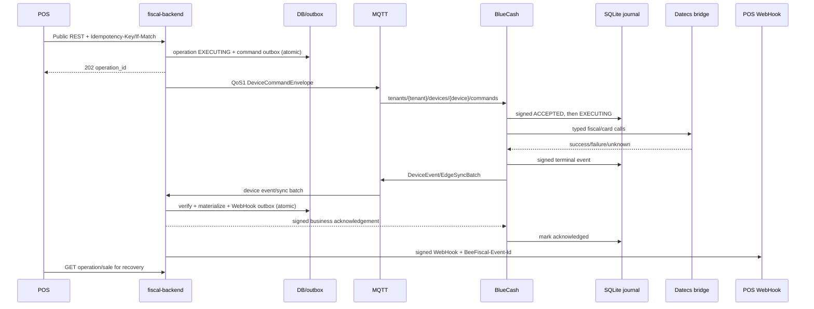

# BlueCash: трассировка REST/WebHook → MQTT/BLE → fiscal protocol

Статус: **as-built**, protocol version `2026-08-07`, аудит 2026-08-14.

## Результат аудита

Программные MQTT, Local HTTP и direct BLE paths до BlueCash-50 замкнуты:

- REST, idempotency, operation state и WebHook outbox реализованы в `fiscal-backend`;
- `fiscal-backend/internal/mqttclient/client.go` публикует подписанные команды QoS 1, принимает `sync/batches`, вызывает `SyncBatchForTenant` и публикует подписанный business ACK;
- `bluecash-app` имеет MQTT runtime, общий command processor, SQLite WAL/FULL journal, Android Keystore ECDSA signatures, ACK verification, reconnect sync и безопасное усечение;
- Datecs fiscal и BORICA pinpad wire protocols реализованы через реальные `com.android.fiscal.jar` и `com.android.pinpad.jar`, извлечённые из предоставленных vendor samples;
- transaction GATT принимает утверждённый для MVP открытый `BFF1` transport,
  проверяет binding/generation, UUID и canonical payload digest и передаёт
  aggregate intent в тот же durable processor;
- activation сохраняет device-bound configuration, MQTT identity и command/ACK
  authority; runtime запускается из активного binding;
- production mTLS/ACL deployment и physical BlueCash HIL остаются отдельными
  gates.

Unit/integration contour доказывает REST-domain → MQTT/HTTP/BLE → Android
processor → Datecs wire call → signed sync → domain/WebHook materialization.
Aggregate `SALE_FINALIZE`, optional discount, ordered split tenders, refund,
printer test, reports и cash movements используют общий journal. Текущий статус
— `SOFTWARE_COMPLETE_HIL_PENDING`; физический BlueCash/acquirer HIL не заявлен.

## Контракты

- внешний POS: [`EXTERNAL_POS_INTEGRATION_PROTOCOL.md`](EXTERNAL_POS_INTEGRATION_PROTOCOL.md);
- OpenAPI: `../../BeeloyBackend/docs/Fiscal/api/openapi-public-v1.yaml` и `../contracts/openapi-runtime-v1.yaml`;
- MQTT: `../../BeeloyBackend/docs/Fiscal/events/asyncapi-device-v1.yaml`;
- BLE: `../../BeeloyBackend/docs/Fiscal/ble/ble-gatt-v1.md`;
- Datecs fiscal examples: `../../BeeloyBackend/docs/Fiscal/Android/DatecsBC/Fiscal/DEMO`;
- Datecs raw protocol: `../../BeeloyBackend/docs/Fiscal/beefiscal_IoT/doc/Datecs/PM_XXXXXX-BUL_CommunicationProtocol_v2.11.4 (7).pdf`, section 4.6 (command 43) and sections 4.12/4.15/4.18 (commands 49/53/56);
- Datecs payment examples: `../../BeeloyBackend/docs/Fiscal/Android/DatecsBC/PinpadSDK/DEMO`.

OpenAPI владеет business payload. MQTT и BLE являются только transport bindings.

## Сквозная target-трасса



REST routes map to `FISCAL_SALE`, `REVERSAL`, `CANCEL`, `X_REPORT`, `Z_REPORT`, `CASH_IN`, `CASH_OUT` and device-management commands. Current synchronous `domain.Driver` must be replaced for physical smart devices by an asynchronous MQTT driver: durable operation and command outbox are committed before publish. Broker PUBACK is never a fiscal result.

## MQTT contract

Command topic: `tenants/{tenantId}/devices/{deviceId}/commands`; sync topics: `tenants/{tenantId}/devices/{deviceId}/sync/batches/{batchId}` и `.../sync/acks/{batchId}`; QoS 1, retained false. Payloads закреплены в runtime OpenAPI `DeviceCommandEnvelope`, `EdgeSyncBatch`, `EdgeSyncAcknowledgement`; correlation is `operation_id`.

Фактический envelope содержит `operation_id`, `tenant_id`, `register_id`, `device_id`, `fencing_token`, `command_type`, timestamps, `payload`, `payload_sha256`, `signature`. `fencing_token` — замороженная версия register binding. HMAC считается по рекурсивно key-sorted JSON без `signature`; payload digest — по тому же canonical JSON. Topic identity обязана совпадать с подписанным payload. BlueCash отклоняет expiry, tenant/device/type/binding mismatch и изменённую подпись до journal или vendor side effect.

Backend MQTT ingress must invoke the same typed validation/materialization as `Service.SyncBatchForTenant`; logging payload is insufficient. Terminal materialization atomically produces REST projection and WebHook event (`succeeded`, `failed`, `reconciliation_required` or `updated`).

## BlueCash → Datecs

Both MQTT and BLE enter one command processor and one idempotency inbox. Only it may invoke `BlueCashFiscalAdapter`/`BlueCashCardAdapter`.

Fiscal sale sequence, confirmed by Datecs examples:

1. connect/probe; validate status bytes, paper and open-document state;
2. for CARD call `authorizeEur(amountMinor, operationId)`; ambiguous timeout is not retried;
3. `receipt_Fiscal_OpenAsync(..., unp, ...)`;
4. fiscal line call per item with quantity, EUR price, tax group and discount;
5. exact CASH/CARD tender;
6. `receipt_Fiscal_CloseAsync()`;
7. read receipt/FM/device/QR references;
8. cancel only before an irreversible close when vendor protocol permits it; ambiguous close becomes `UNKNOWN` and lookup/reconcile only.

Reversal sequence is separately typed and cannot be represented as an ordinary fiscal sale: card payment is reversed against the persisted original payment operation, then Datecs command `43` opens the storno document with reason, original receipt number/date-time, fiscal-memory number and original UNP; commands `49`, `53`, `56` print the original lines, refund tender and close it. The reversal operation has its own idempotency key/journal lifecycle. A crash after `EXECUTING` returns `UNKNOWN` and never repeats card or fiscal side effects automatically.

Vendor evidence conflict: the supplied BlueCash C# demo calls `open_StornoReceiptAsync`, while the generic Datecs protocol v2.11.4 note below command 43 says that the command is not used on BC-50. Therefore the software maps the demonstrated SDK semantics to the documented wire fields, but physical BC-50 storno remains a P0 HIL/vendor-confirmation gate; it must not be marked PROD-ready from unit tests alone.

The vendor bridge must be typed/exhaustive. Raw Datecs commands must never be exposed to POS. Physical purchase/decline/timeout/void, receipt and X/Z evidence requires HIL.

## Direct BLE API

Activation GATT is separate from transaction GATT. Целевой обязательный MVP
transaction API — `OPEN_MVP`; текущий BlueCash implementation ещё должен быть
приведён к нему по P0 remediation:

- command characteristic: framed canonical payload of OpenAPI `ComplianceIntent`;
- event characteristic: ACK/NACK, READY and `ComplianceIntentResult`.

POS получает route package через authenticated REST и выбирает устройство только
по `advertising_identity`. BLE и MQTT используют одинаковые `operation_id`,
payload digest, journal и executor. В MVP BLE-канал открыт и сам по себе не
авторизует POS; устройство всё равно проверяет active binding и generation,
идемпотентность и доступность конечного ФУ. При недоступном ФУ продажа
блокируется. Защищённый X25519/HKDF/AES-GCM profile отложен до production.

## SQLite journal

Required logical schema:

```sql
CREATE TABLE command_inbox (
 command_id TEXT PRIMARY KEY, payload_sha256 TEXT NOT NULL,
 source TEXT NOT NULL CHECK(source IN ('MQTT','BLE')),
 operation_id TEXT NOT NULL, state TEXT NOT NULL,
 received_at TEXT NOT NULL, terminal_event_seq INTEGER
);
CREATE TABLE journal_event (
 journal_seq INTEGER PRIMARY KEY AUTOINCREMENT,
 event_id TEXT NOT NULL UNIQUE, operation_id TEXT NOT NULL,
 tenant_id TEXT NOT NULL, location_id TEXT NOT NULL,
 register_id TEXT NOT NULL, device_id TEXT NOT NULL,
 binding_version INTEGER NOT NULL, event_type TEXT NOT NULL,
 occurred_at TEXT NOT NULL, payload_cbor BLOB NOT NULL,
 prev_hash TEXT, event_hash TEXT NOT NULL UNIQUE,
 signing_kid TEXT NOT NULL, signature BLOB NOT NULL,
 backend_ack_id TEXT, acknowledged_at TEXT, created_at TEXT NOT NULL
);
CREATE TABLE sync_checkpoint (
 singleton INTEGER PRIMARY KEY CHECK(singleton=1),
 committed_through_seq INTEGER NOT NULL,
 committed_event_hash TEXT, ack_id TEXT, acknowledged_at TEXT
);
```

SQLite uses WAL, foreign keys and `synchronous=FULL`. `ACCEPTED` is committed before vendor side effect, then `EXECUTING`; `FISCALIZED`/`FAILED`/`UNKNOWN` is committed before result delivery. Duplicate `command_id + same hash` returns the stored result; a different hash is conflict.

## Сквозная подпись

Локальная journal chain и transport chain разделены. Локальная запись подписывает собственный deterministic journal digest. Transport `event_hash = SHA-256(exact Go JSON event с пустым event_hash и null signature)`; batch использует такой же exact Go JSON contract. `prev_hash` связывает transport events. Каждый event и batch подписывается non-exportable Android Keystore ECDSA-P256 key (StrongBox when available). Backend проверяет зарегистрированный при activation device public key/kid, подпись и chain continuity. Hardware attestation остаётся production-hardening gate.

Current shared backend HMAC `BLE_SIGNING_KEY` is DEV compatibility and does not satisfy hardware-backed per-device signing. Target trust store contains device public keys with validity intervals and auditable rotation.

## Sync and retention

Worker sends at most 100 contiguous events after checkpoint as OpenAPI `EdgeSyncBatch`: first/last seq, previous acknowledged hash, events, batch hash/signature. Recommended topics are `.../sync/batches/{batch_id}` and `.../sync/acks/{batch_id}`. Backend deduplicates exact bytes, verifies topic/payload identity, gap, hashes and signatures, atomically materializes results, then returns a signed **business ack**. Only verified business ack advances checkpoint; MQTT PUBACK does not.

Retry uses one in-flight immutable batch and jittered backoff `1s, 2s, 5s, 10s, 30s, 1m, 5m, 15m`. After reconnect sync resumes at `committed_through_seq + 1`. Gap/conflict sets `SYNC_BLOCKED` and blocks new fiscal side effects pending safe recovery.

Three months is a minimum retention, not a TTL. Purge is allowed only when the row has `backend_ack_id` and `acknowledged_at`, is at/below committed checkpoint, is older than three calendar months in Europe/Sofia, and a signed chain anchor remains. Unacknowledged records are never deleted by age. Daily purge is batched; VACUUM is outside fiscal transaction.

## As-built matrix

| Requirement | Current artifact | Status |
|---|---|---|
| REST/idempotency/versioning | fiscal API/domain | PASS |
| durable operation before effect | reservation + Android ACCEPTED/EXECUTING before vendor I/O | PASS; crash recovery fail-closes to UNKNOWN |
| MQTT command publisher/outbox | atomic `device_command_outbox` ResourceRecord + `Bridge.Prepare/Publish/FlushOutbox` | PASS software/unit: immutable envelope committed with operation/sale, reconnect republish, expiry → UNKNOWN + WebHook |
| MQTT result → domain | `Processor.Process` → `SyncBatchForTenant` → signed ACK | PASS |
| activation/binding | backend activation + persisted device configuration | PASS software; HIL pending |
| BLE MVP profile | MiniPOS и BlueCash `OPEN_MVP` BFF1 | PASS software; физический BLE HIL pending |
| BLE GATT/control | `BlueCashTransactionGattServer` + `BlueCashOpenMvpFrames` | PASS: открытый MVP framing, binding fence, UUID/digest replay control |
| BLE ComplianceIntent execution | `BlueCashComplianceIntentExecutor` → `BlueCashCommandProcessor` | PASS: aggregate SALE_FINALIZE, discount, ordered split, reversal и printer test |
| BLE local aggregate/UNP | SQLite v2 `ble_local_sale`, processed intent hashes/results, `ble_unp_range` | PASS software; physical Android instrumentation pending |
| shared BLE/MQTT/HTTP processor | все каналы входят в `BlueCashComplianceIntentExecutor`; ACCEPTED хранит canonical payload | PASS software |
| SQLite journal/recovery | `AndroidTransactionJournal`, WAL/FULL, fail-closed EXECUTING recovery | PASS software/unit; instrumentation pending |
| per-event hardware signature | Keystore ECDSA + backend per-device P-256 verifier | PASS software; hardware attestation is production hardening |
| acknowledged 3-month retention | signed ACK required; Europe/Sofia three calendar months; anchor retained | PASS software/unit |
| reconnect sync/business ack | persistent journal, reconnect flush, signed ACK verification | PASS software/unit; broker fault test pending |
| Datecs fiscal/card bridge | vendor Android JAR runtime + fiscal/BORICA protocol adapters | PASS software/unit; physical HIL BLOCKED |
| terminal result → WebHook | atomic sync materialization/outbox | PASS software/unit |

## Оставшаяся приёмка

Software acceptance закрыта общим MVP1 gate. До physical MVP остаются Android
instrumentation на целевом BlueCash-50, реальные fiscal/card сценарии,
broker/network/power fault injection и доказательство одного side effect при
duplicate/lost ACK. До production дополнительно обязательны защищённый BLE,
production PKI/mTLS/ACL и vendor/acquirer acceptance.
