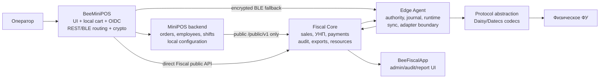
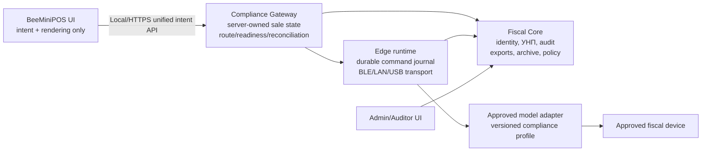

# Аудит архитектуры Fiscalisation / BeeMiniPOS на соответствие SUPTO

**Дата анализа:** 10 августа 2026 г.  
**Объект:** `/Users/freelancer/Documents/Beeloy/Fiscalisation`  
**Эталон требований:** `/Users/freelancer/Documents/Beeloy/Fiscalisation/docs/SUPTO/index.md`  
**Заявленная эталонная POS-реализация:** `/Users/freelancer/Documents/Beeloy/Fiscalisation/BeeMiniPOS/README.md` и фактический код BeeMiniPOS  
**Метод:** статический архитектурный и трассировочный аудит исходного кода, контрактов, схем БД, тестовых матриц и внутренних acceptance-документов. Полный regression и испытания на физическом ФУ в рамках этого аудита не запускались.

> Этот документ оценивает соответствие локальному файлу `docs/SUPTO/index.md`, а не заменяет юридическое заключение, испытания с одобренными моделями ФУ, декларацию производителя или проверку НАП/БИМ.

## 1. Краткий ответ на три главных вопроса

### 1.1. Реализует ли связка все требования SUPTO?

**Нет. На текущем срезе — однозначно нет.**

Это следует не только из внешних аппаратных/юридических блокеров, но и из фактических программных разрывов в основном сценарии продажи:

1. В собственном реестре соответствия профиль `BG-SUPTO-PROFILE-014` имеет статус `EXCLUDED_MVP`, а acceptance-профиль называется `BG_MVP_FUNCTIONAL_NONPROD`. Production и pilot имеют статус `NO_GO`.
2. BeeMiniPOS накапливает товары в локальном React state и создаёт MiniPOS order, строки и Fiscal sale только после нажатия оплаты. Это противоречит требованию открыть продажу и присвоить УНП не позднее ввода первого товара.
3. УНП в cloud-ветке строится как `register_id-operator_id-sequence`. В актуальном MiniPOS/Runtime контракте `register_id` — UUID. Это не формат `8-символьный ИН ФУ–4-символьный код оператора–7 цифр`.
4. BeeMiniPOS не отображает УНП в форме открытой продажи. До checkout серверной продажи и УНП вообще нет.
5. Реализовано чтение часов отдельных моделей ФУ, но не найден исполненный ежедневный workflow синхронизации времени рабочего места и ФУ с журналом результата и fail-closed политикой.
6. Проверка readiness выполняется перед checkout, но текущий POS flow не доказывает обязательную проверку при запуске рабочего места и при открытии продажи, двухчасовую свежесть ИН/готовности и блокировку открытия продаж после истечения этого окна.
7. Полный hardware/vendor/HIL контур отсутствует: production adapter в Edge остаётся `unsupported`, физические GATT/USB/UART реализации и доказательства по одобренным ФУ не закрыты.
8. Декларационные, сервисные, BIM/НАП, release-signing и IdP evidence остаются внешними блокерами.

При этом система содержит значительный объём качественно реализованной инфраструктуры: tenant isolation/RLS, идемпотентность, immutable audit, UNKNOWN/reconciliation, сторно, exports, operator model, OIDC, signed BLE authority, durable Edge journal, sync ACK, OTA policy и адаптерные codecs. Это сильная основа, но не полное SUPTO.

### 1.2. Максимально ли вынесена ответственность в промежуточный слой?

**В значительной степени — да, но не максимально и не последовательно.**

Хорошо вынесены в Fiscal Core / MiniPOS backend / Edge:

- операторская authority и RBAC;
- каталог, заказы, расчёты и платежные orchestration;
- состояния фискальной операции;
- идемпотентность и защита от повторной фискализации;
- UNKNOWN → reconciliation;
- append-only аудит и hash chain;
- exports и auditor read access;
- реестр объектов, касс, операторов и устройств;
- долговечный Edge journal, fencing и sync;
- vendor codecs и fail-closed command registry;
- production guards, signed release/OTA groundwork.

Но важная юридическая ответственность осталась или дублируется в POS:

- именно POS определяет момент, когда локальная корзина становится серверной продажей;
- POS сам держит authoritative pre-checkout cart, quantity и discount state;
- POS выбирает REST/BLE маршрут и формирует offline fiscal sale envelope;
- POS содержит криптографию, BLE handshake, framing, CBOR и fiscal command dispatch;
- POS сам выполняет readiness orchestration непосредственно перед checkout;
- POS вычисляет total и split remainder для UI/checkout payload;
- отсутствие server-issued `allowed_actions` для каждого шага открытой продажи заменено локальными UI-условиями.

Следовательно, граница сейчас оптимизирована скорее под offline-capable rich client, чем под минимальный декларируемый SUPTO-клиент.

### 1.3. Делает ли граница BeeMiniPOS максимально тонким для требований и сертификации?

**Нет. BeeMiniPOS функционально тоньше обычного POS, но не является максимально тонким compliance-клиентом.**

Он включает значимый фискальный transport/security runtime: OIDC lifecycle, прямой REST к Fiscal, Web/native BLE, session-ticket validation, X25519/HKDF/AES-GCM, binary framing, flow control, device probe, route selection, offline command envelope и UNKNOWN mapping. Изменения в этих частях могут влиять на юридически значимое поведение и увеличивают сертификационную поверхность мобильного модуля.

Для действительно тонкой модели POS должен отправлять только пользовательские намерения в единый локальный/сетевой Compliance Gateway API и отображать серверное состояние. Выбор транспорта, формирование fiscal envelope, выдача УНП, readiness freshness, retry/reconciliation policy и вся BLE-криптография должны находиться за этой границей.

## 2. Что именно было проверено

Проверены следующие классы артефактов:

- `docs/SUPTO/index.md` — 24 функциональных блока Приложения №29 и дополнительные обязанности;
- `BeeMiniPOS/App.tsx` и `BeeMiniPOS/src/*` — фактический POS flow, OIDC, REST/BLE и reconciliation;
- `beeminipos-backend` — автономная POS-модель, orders, shifts, employee sessions и Fiscal client;
- `fiscal-backend` — sales, payments, reversal, audit, exports, resources, RLS и API;
- `edge-agent` — authority, journal, runtime, device adapter, BLE, sync и OTA;
- `IoT/protocol-abstraction` — Daisy/Datecs command registry, builders и parsers;
- `database/*` — typed projections, isolation, snapshots и idempotency;
- `contracts/*` — OpenAPI runtime surface, SUPTO trace, acceptance и regression matrices;
- `IMPLEMENTATION_STATUS.md`, `MVP_COMPLETION_AUDIT.md`, `MVP_GATES.md`, `MVP_BLOCKERS.md` — заявленные ограничения и evidence.

README BeeMiniPOS содержит только указание на Expo React Native и команды запуска. Сам по себе он не является ни архитектурным описанием, ни руководством пользователя, ни декларационным evidence. Поэтому оценка POS выполнена по коду и контрактам.

## 3. Фактическая архитектура и границы ответственности



Архитектура разделяет BeeMiniPOS и Fiscal как два продукта с отдельными БД, Compose-проектами, Caddy и сетями. MiniPOS backend обращается к Fiscal через публичный API. Это хорошая техническая изоляция, но для SUPTO создаёт вопрос декларационной границы: POS, MiniPOS backend, Fiscal Core, BeeFiscalApp, Edge, firmware и конкретные adapter builds должны быть перечислены как модули одной интегрированной системы либо иметь очень чётко оформленный режим интеграции/импорта.

Наиболее рискованный участок — наличие двух путей исполнения одной фискальной операции:

```text
REST: BeeMiniPOS → MiniPOS backend → Fiscal Core → driver/edge → ФУ
BLE:  BeeMiniPOS → encrypted BLE → Edge → ФУ → поздняя синхронизация в Fiscal Core
```

Логика route freeze и UNKNOWN защищает от автоматического fall-through и двойного чека. Однако оба пути должны давать идентичные SUPTO-инварианты: один источник sequence, корректный ИН в УНП, открытие на первом товаре, readiness freshness, одинаковый audit schema, cancellation, partial payments, storno и восстановление. Сейчас эквивалентность этих путей для полного SUPTO не доказана.

## 4. Критические несоответствия

### C-01. Продажа открывается слишком поздно

В `BeeMiniPOS/App.tsx` нажатие на товар вызывает локальную функцию `add(...)`, которая меняет React `cart`. Создание `/orders`, добавление `/orders/{id}/lines` и вызов Fiscal происходят внутри `checkout(...)` только после выбора платежа.

Это прямо расходится с разделом 3.9 эталона:

```text
Первый товар → CORE → readiness/ИН → sale + УНП → ответ POS → отображение
```

Риски:

- введённые, затем удалённые до оплаты позиции не попадают в обязательный след аннулирования;
- нет УНП во время фактически открытой кассиром формы;
- потеря/закрытие приложения уничтожает pre-checkout evidence;
- readiness при открытии продажи не выполняется;
- невозможно доказать последовательность `first input → УНП`.

**Статус:** FAIL.  
**Владелец исправления:** MiniPOS backend + Fiscal Core; POS должен стать renderer/server-state client.

### C-02. Формат и источник УНП не соответствуют требованию

Cloud repository формирует candidate как:

```text
RegisterID + "-" + OperatorID + "-" + pad7(sequence)
```

Edge sync использует тот же принцип. Одновременно текущие runtime contracts и MiniPOS configuration требуют UUID `fiscal_register_id`. Получается UUID-префикс, а не восьмисимвольный ИН ФУ.

Даже если исторические тесты используют `FD000001`, это не доказывает актуальный production path: новый identity gate требует canonical UUID register/device identifiers.

Дополнительно sequence keyed по tenant + register, тогда как требование задаёт последовательность по ИН ФУ и отдельные диапазоны, если несколько СУПТО используют одно ФУ.

**Статус:** FAIL.  
**Нужно:** выделить immutable `fiscal_device_number`/FMIN как отдельное поле authority; формировать УНП только из проверенного Edge/device identity; sequence key = tenant + FMIN + declared range owner; regex/invariant на всех путях и в БД.

### C-03. УНП не отображается в открытой форме

В POS нет server sale/УНП до checkout. После успеха footer показывает fiscal reference или operation ID, но не обязательный УНП открытой продажи.

**Статус:** FAIL.

### C-04. Нет законченного ежедневного time-sync workflow

Protocol abstraction умеет читать часы Daisy/Datecs. Но наличие parser для команды 62 не равно требованию:

- надёжный источник астрономического времени;
- проверка drift backend/edge/ФУ;
- sync при старте или минимум раз в рабочий день;
- audit old/new/source/result;
- блокировка при недопустимом drift.

Исполненный orchestrator/state/evidence для этого не найден.

**Статус:** FAIL/NOT IMPLEMENTED.

### C-05. Readiness реализована не во всех обязательных точках

Есть registry-aware readiness и final-device probe, включая fail-closed блокировку. Это сильная часть. Однако POS проверяет readiness в checkout. Из-за локальной корзины нет проверки при открытии продажи. Также не найден законченный инвариант `verified FMIN/ready ≤ 2h` для открытия следующей продажи и обязательная проверка при startup рабочего места.

**Статус:** PARTIAL.

### C-06. Полный SUPTO профиль сознательно исключён

`contracts/bg-requirements-trace.json` фиксирует:

```text
BG-014 EXCLUDED_MVP: full BG_SUPTO declaration track is outside MVP
BG-015 PARTIAL: full SUPTO declaration profile is excluded from base MVP
```

`contracts/mvp-acceptance-v1.json` фиксирует `BG_MVP_FUNCTIONAL_NONPROD`, `pilot_status: NO_GO`, `production_status: NO_GO`.

Это достаточное основание не принимать любые общие формулировки README о compliance как доказательство полного SUPTO.

### C-07. Нет production hardware path и доказательств для всех устройств

Edge README указывает, что production adapter остаётся `unsupported`, а simulator запрещён. Физический GATT server, USB/UART wiring и vendor hardware track требуют HIL. Protocol abstraction имеет широкое семантическое покрытие Daisy/Datecs, но:

- это не «все сертифицированные кассовые аппараты»;
- нет Tremol и других adapter implementations;
- нет production evidence даже для всех заявленных Daisy/Datecs tracks;
- часть payment commands исключена до vendor/acquirer closure;
- нет golden comparison с реально напечатанными чеками/сторно/КЛЕН;
- добавление модели/драйвера влияет на декларируемую версию SUPTO.

**Статус:** EXTERNAL_BLOCKED + incomplete coverage.

## 5. Матрица требований `docs/SUPTO/index.md`

Обозначения:

- **PASS-SW** — программная основа реализована, но это не юридическая сертификация;
- **PARTIAL** — реализована существенная часть, остаётся функциональный или evidence gap;
- **FAIL** — основной фактический flow нарушает требование;
- **N/A-CONDITIONAL** — применимо только при включении соответствующей функции;
- **EXTERNAL** — невозможно закрыть одним кодом.

| № | Требование | Оценка | Фактическая реализация / разрыв | Предпочтительный владелец |
|---:|---|---|---|---|
| 1 | Болгарский интерфейс | PASS-SW / PARTIAL evidence | Кассовые тексты BeeMiniPOS преимущественно на болгарском; технические error codes иногда выводятся как часть сообщения. Нужен полный inventory всех экранов, ошибок, accessibility и Admin UI. | POS presentation + централизованный BG message catalog |
| 2 | Полнота и целостность | PARTIAL | Typed PostgreSQL, RLS, idempotency claims, hash-chain audit, Edge WAL/FULL, durable-before-device и sync ACK сильны. Но local pre-checkout cart выпадает из compliance trail; physical retention/HIL и WORM/backup operational evidence не закрыты. | Core/DB/Edge |
| 3 | Отменён | N/A | Нет требования. | — |
| 4 | Защита от неавторизованных модулей | PARTIAL | OIDC/RBAC, production guards, signed OTA/release groundwork есть. Secure Boot, Flash Encryption, JTAG lock, independently trusted signed release, vulnerability scan и device enforcement — NO-GO/external. Expo/mobile supply chain остаётся частью поверхности. | Release platform + Edge boot chain + Core version gate |
| 5 | Точное время и sync ФУ | FAIL | Есть parser чтения часов, но нет complete daily synchronization control loop и audit evidence. | Edge compliance runtime + Core policy |
| 6 | Данные операторов | PASS-SW | Fiscal operator требует 4 символа, first/last name, roles, active_from/to; tenant-scoped. MiniPOS employee и Fiscal operator — отдельные сущности, поэтому consistency provisioning должен быть формально управляем. | Fiscal Core identity authority |
| 7 | Однозначная аутентификация | PARTIAL | PROD OIDC Authorization Code + PKCE, app-instance session, logout revocation и subject binding реализованы. Реальный passwordless/passkey IdP deployment evidence отсутствует. | IdP + MiniPOS backend session authority |
| 8 | Связь/готовность ФУ | PARTIAL | Final-device registry gate, REST readiness и encrypted device probe реализованы. Не покрыты startup + first-item/open-sale + two-hour freshness как единый state machine; HIL отсутствует. | Edge/Core readiness lease; POS только показывает |
| 9 | Генерация и показ УНП | FAIL | Allocation concurrency тестируется, но prefix берётся из register ID; актуальный register ID UUID. Продажа/УНП создаются только при checkout; УНП не показывается в форме. | Fiscal Core/Edge authority |
| 10 | Платёж и команда ФУ | PARTIAL | Cash/card/split, idempotency, durable reservation, UNKNOWN и storno reference реализованы. Vendor printed receipt, partial payment/storno HIL и правильный УНП не закрыты. | Core/Edge/adapters |
| 11 | Запрет служебных бонов для заказов | PARTIAL / not evidenced | API разделяет cash movement и fiscal sale; явного централизованного policy/template gate для всех нефискальных документов и терминологии не найдено. | Core document policy + adapter templates |
| 12 | Аннулирование открытой продажи | FAIL/PARTIAL | Fiscal Core имеет cancellation и append-only audit, но пользовательская local cart до checkout не является открытой серверной sale; удаление/изменение локальных строк не создаёт обязательных cancellation events с УНП. | Core-owned open sale from first item |
| 13 | Защита завершённых продаж и сторно | PASS-SW / PARTIAL HIL | Append-only reversal, original reference, reason policy, second reversal rejection и allowed_actions есть. Physical storno golden/HIL не закрыт. | Core/Edge |
| 14 | Запрещённые слова на нефискальных документах | PARTIAL / not evidenced | Не найден универсальный server-side validator всех templates/print payloads. UI-тексты о фискальном результате не равны печатному нефискальному документу, но политика должна быть явной. | Core document rendering policy |
| 15 | Структурированный audit | PARTIAL | Persistent hash-chained audit, actor/action/object/before/after/УНП есть. Требуется доказать точные обязательные login/logout, role-history, nomenclature change, cancel/storno event semantics и секунды для всех веток, включая offline first-item flow. | Core audit service + immutable DB |
| 16 | Просмотр журнала и фильтры | PARTIAL/PASS-SW | BeeFiscalApp + `/audit-events` дают period/operator/УНП и auditor/admin read. Контракт не показывает отдельный action filter; UI evidence надо сверить с точным набором п.16. | Admin/Core |
| 17 | Текущие и архивные данные | PARTIAL | Typed DB, backup/restore runbook и access surfaces есть. Полный срок хранения по ДОПК, production archive migration/readability и EU/BG data residency operational evidence не доказаны кодом. | Backend/archive/operations |
| 18 | Визуализация и CSV/XLSX export | PARTIAL | Реализованы SUPTO_18_1/_2/_3/_4/_5/_9, JSON/CSV/XLSX, tenant filters и immutable sale-time snapshots. Нужна field-by-field проверка всех обязательных колонок и UI filters; 18.6–18.8 должны оставаться формально исключёнными, если поставки/склад не входят в продукт. | Core export service + Admin |
| 19 | Auditor read-only profile | PASS-SW / PARTIAL deployment | AUDITOR RBAC не может mutate sales и может читать audit/exports. Нужны реальный IdP role provisioning, archive/config/reference access и tenant isolation evidence в production. | IdP/Core/Admin |
| 20 | Нет test/training в PROD | PASS-SW / EXTERNAL | PROD guards запрещают simulator/STUB/static token/HTTP. Требуются release artifact inspection и deployment controls; source содержит DEV/HIL surfaces, которые должны быть физически исключены из production bundle/config. | Build/release gate |
| 21 | Функции интегрированной системой | PASS architecture | Audit/export/admin вынесены из кассового UI. Нужно формально декларировать все модули как интегрированное SUPTO. | Product/compliance architecture |
| 22 | Импорт продаж | PARTIAL / boundary risk | MiniPOS оформлен как отдельный автономный продукт и вызывает Fiscal public API. Если регулятор сочтёт это отдельным источником, нужны полные Приложения 41/42: raw payload, source, rejected imports, before/after и linkage. Безопаснее декларировать единым SUPTO-модулем, но фактический late checkout flow всё равно надо исправить. | Core integration contract |
| 23 | Экспорт в другие системы | PARTIAL | Public API/webhooks и export есть, обратная неаудированная мутация ограничена auth/contract. Нужен формальный перечень интеграций и immutable outbound evidence. | Core integration gateway |
| 24 | Электронные фискальные чеки | N/A-CONDITIONAL / not complete | Receipt artifact/lookup есть, но delivery email/profile, recipient/method audit и paper-on-request workflow не реализованы как полный режим. Не заявлять этот режим до реализации. | Core receipt delivery service |

## 6. Оценка собственной BG traceability системы

Внутренний `bg-requirements-trace.json` полезен и честно не повышает внешние gaps до PASS:

| Статус | Количество |
|---|---:|
| PASS | 7 |
| PARTIAL | 12 |
| EXTERNAL_BLOCKED | 5 |
| EXCLUDED_MVP | 1 |

Однако этот реестр не заменяет матрицу Приложения №29 из `docs/SUPTO/index.md`. Его BG-001…BG-025 включают аппаратные и иные болгарские фискальные требования, но не дают прямого one-to-one доказательства для всех пунктов 1–24 SUPTO. Особенно плохо проявлены:

- точный момент открытия продажи;
- отображение УНП в форме;
- ежедневный time sync;
- двухчасовое readiness lease;
- запретные надписи/шаблоны нефискальных документов;
- полный перечень обязательных audit events;
- archive retention/access;
- field-by-field export 18.x;
- декларационная граница единой интегрированной системы.

Рекомендуется завести отдельный machine-readable `supto-annex29-trace.json`, где каждая строка имеет:

```json
{
  "requirement": "SUPTO-29-09",
  "owner": "fiscal-core",
  "invariant": "UNP issued on first entered item from verified 8-char FMIN",
  "api": ["openSaleWithFirstLine"],
  "db_constraints": ["unp_format", "unp_unique_by_tenant"],
  "tests": ["cloud", "offline-edge", "restart", "concurrency", "HIL"],
  "evidence": [],
  "status": "FAIL"
}
```

Статус должен вычисляться gate-скриптом и быть `PASS` только при существующих software + HIL + legal evidence, относящихся именно к выбранному production profile.

## 7. Насколько удачна текущая граница ответственности

### 7.1. Сильные решения

1. **Fiscal Core как источник завершённой продажи.** Durable payment reservation и атомарный commit с receipt/outbox уменьшают риск двойного документа и «успеха без evidence».
2. **UNKNOWN как отдельное состояние.** Запрет blind retry и reconciliation — правильный принцип для необратимых фискальных команд.
3. **Edge durable-before-device.** Команда сначала фиксируется, затем отправляется на ФУ; restart не должен повторять уже потенциально выполненную команду.
4. **Tenant isolation.** Separate databases + FORCE RLS + non-owner reader roles — хорошая база SaaS SUPTO.
5. **Adapter fail-closed.** Unknown/Excluded vendor commands не активируются автоматически.
6. **Signed authority и binding.** BLE ticket связан с tenant/location/register/edge/fiscal device/app/operator и ограничен сроком.
7. **Admin/auditor separation.** Большая часть пп.16–19 вынесена из POS, как допускает п.21.
8. **Immutable snapshots.** Sale-time device/location evidence сохраняется независимо от последующего rebind.

### 7.2. Где ответственность находится слишком высоко, в POS

| Сейчас в BeeMiniPOS | Почему увеличивает compliance surface | Куда вынести |
|---|---|---|
| Локальное создание/изменение корзины | Определяет момент открытия продажи и потерю cancel evidence | Server-owned draft sale API с первым товаром |
| Расчёт total/split | Клиент может расходиться с authoritative tax/rounding | Core возвращает totals и допустимые payment intents |
| Readiness orchestration | POS выбирает момент и значение готовности | Gateway/Core выдаёт signed readiness lease/allowed_actions |
| REST/BLE route choice | Влияет на exactly-once и audit path | Локальный Compliance Gateway выбирает транспорт |
| Offline fiscal envelope | POS сериализует юридически значимые items/payments/identity | Gateway получает intent, сам строит canonical command |
| X25519/HKDF/AES-GCM, frames, flow | Любое изменение app влияет на доверенную транспортную реализацию | Local agent/native trusted module |
| Reconciliation mapping | POS интерпретирует terminal states | Core/Gateway возвращает canonical presentation state |
| Device probe | POS участвует в разрешении исполнения | Gateway поддерживает freshness lease |

### 7.3. Что неизбежно остаётся в POS

Даже максимально тонкий POS остаётся декларируемым UI-модулем и должен:

- быть полностью на болгарском;
- обеспечивать персональный вход и logout;
- не позволять действия вне server `allowed_actions`;
- отправлять первый товар немедленно;
- показывать УНП, ФУ, readiness и состояния;
- блокировать новые действия при UNKNOWN/reconciliation;
- подтверждать payment intent;
- показывать cancel/storno/receipt outcome;
- проверять minimum supported app version;
- не иметь test/training mode или произвольных plugins/templates в production.

Тонкий клиент не означает отсутствие требований к UI; это означает отсутствие в UI самостоятельной compliance business authority.

## 8. Рекомендуемая целевая граница



### 8.1. Единый intent API для POS

Минимальный API должен быть симметричен для online/offline deployment:

```text
POST /workstations/{id}/session/start
POST /sales:open-with-line
POST /sales/{id}/lines
POST /sales/{id}/lines/{line}:cancel
POST /sales/{id}:cancel
POST /sales/{id}/payment-intents
GET  /operations/{id}
POST /operations/{id}:reconcile
POST /sales/{id}:reverse
```

Ключевое требование: первый endpoint изменения продажи атомарно делает следующее:

1. проверяет operator session и смену;
2. проверяет актуальный readiness lease и подтверждённый 8-char FMIN;
3. резервирует sequence в объявленном диапазоне;
4. создаёт sale + первую line + УНП в одной транзакции;
5. пишет audit event;
6. возвращает `sale_id`, `unp`, authoritative totals, device identity, readiness expiry и `allowed_actions`;
7. только после этого UI показывает строку как принятую.

### 8.2. Offline без переноса compliance logic в POS

Если облако недоступно, BeeMiniPOS должен обращаться к локальному Compliance Gateway, а не формировать fiscal command самостоятельно. Gateway должен иметь заранее выданный fenced range для:

- sale/operation identifiers;
- УНП sequence конкретного FMIN;
- operator/session authority;
- policy/version bundle;
- expiry и maximum offline horizon.

После восстановления Gateway синхронизирует exact append-only events. POS видит одинаковый API и одинаковые states независимо от транспорта.

### 8.3. Readiness lease

Core/Edge должен выдавать объект:

```json
{
  "workstation_id": "...",
  "fiscal_device_id": "...",
  "fiscal_device_number": "AB123456",
  "ready": true,
  "verified_at": "...",
  "valid_for_open_sale_until": "... <= 2h",
  "must_recheck_before_payment": true,
  "clock_sync_date": "2026-08-10",
  "policy_version": "...",
  "signature": "..."
}
```

POS не должен сам вычислять свежесть или подменять device ID. `allowed_actions` выдаются только при действительном lease.

### 8.4. УНП как отдельный доменный тип

Нельзя использовать `register_id` как первую часть УНП. Ввести:

- `FiscalDeviceNumber` — ровно 8 разрешённых символов, прочитанных/подтверждённых с ФУ;
- `OperatorCode` — ровно 4 alphanumeric;
- `UNPSequence` — 1..9_999_999;
- canonical formatter с единым разрешённым разделителем;
- DB check constraint и unique index;
- immutable snapshot на sale;
- range lease с owner/version/fencing;
- запрет смены FMIN после первой строки;
- миграционный запрет для старых UUID-based УНП.

Одинаковая библиотека/набор golden vectors должны использоваться Cloud и Edge.

## 9. План закрытия разрывов

### P0 — до заявления SUPTO или пилота

1. Перевести POS на server-owned open sale при первом товаре; каждое quantity/discount/remove — отдельная server mutation/audit event.
2. Исправить УНП: verified 8-char FMIN, 4-char operator, 7-digit sequence, declared range ownership; запретить UUID prefix.
3. Отображать УНП постоянно с первой строки и сохранять его во всех cancel/storno/payment/receipt paths.
4. Реализовать startup/open/payment readiness state machine с двухчасовым lease и блокировкой.
5. Реализовать ежедневный trusted-time/ФУ sync workflow и audit.
6. Убрать BLE fiscal serialization/routing из POS за локальный Compliance Gateway API либо формально принять и тестировать мобильный transport module как часть сертифицируемой поверхности.
7. Сформировать Annex 29 traceability 1–24 и fail-closed release gate.
8. Выбрать точные production модели/firmware и закрыть physical GATT/USB/UART + printed golden + power-loss HIL.
9. Устранить security release NO-GO: подписанный release, independent trust key, zero High/Critical scan или официальный remediation path.
10. Закрыть официальный SUPTO full profile и декларационную документацию; изменить acceptance только внешним подписанным evidence.

### P1 — полнота audit/admin/export

1. Сделать event catalog с обязательными `LOGIN`, `LOGOUT`, role before/after, `SALE_OPENED`, line add/change/cancel, payment intent, device command/result, storno и nomenclature change.
2. Проверить action filter в audit UI/API.
3. Провести field-by-field golden tests для 18.1–18.5 и 18.9 во всех CSV/XLSX exports.
4. Зафиксировать exclusion supply/inventory/e-receipt функций в product profile; если они появляются — автоматически включать соответствующие требования.
5. Добавить server-side policy для нефискальных document templates и banned fiscal wording.
6. Доказать archive retention, backup/restore, historical app compatibility и EU/BG data residency.
7. Свести MiniPOS employee и Fiscal operator в формальную provisioning/consistency модель без возможности orphan/mismatched authority.

### P2 — снижение стоимости сертификации новых моделей

1. Ввести `DeviceComplianceProfile` по каждой model + firmware + adapter version.
2. Автоматически генерировать capability matrix: identity, readiness, time, sale, partial/split, storno, last document, KLEN, reports, ambiguity recovery.
3. Запрещать production activation без approved-type registry evidence, vendor golden vectors, HIL record и service dossier.
4. Отделить universal canonical semantics от model-specific optional commands.
5. Добавлять новый adapter только как подписанный versioned release с декларационным impact assessment.

## 10. Критерии готовности, после которых можно повторить аудит

Связку можно назвать технически готовой к SUPTO compliance review только если одновременно выполняются условия:

- full SUPTO profile больше не `EXCLUDED_MVP`;
- все 24 строки Annex 29 имеют PASS или документированное неприменение;
- первый товар создаёт серверную/Edge sale и УНП атомарно;
- УНП проходит exact format golden tests во всех online/offline/restart/concurrency сценариях;
- UI всегда показывает УНП и не имеет локальной неучтённой продажи;
- startup/open/payment readiness и time-sync доказаны test + HIL + audit;
- выбран закрытый список одобренных ФУ/firmware;
- каждый adapter имеет printed receipt/storno/KLEN golden evidence;
- production hardware path не `unsupported` и не simulator/STUB;
- auditor получает current + archive + export + configuration read-only access;
- release подписан доверенным ключом, scan принят, IdP развернут;
- декларация, приложение 31/32, manuals, DB schema и service evidence подготовлены и внешне подписаны;
- acceptance record имеет PILOT/PROD GO только после внешнего evidence, а не после simulator tests.

## 11. Итоговая оценка

| Вопрос | Итог | Уверенность |
|---|---|---|
| Все ли требования SUPTO реализованы? | **Нет** | Высокая: full profile исключён; найдены прямые программные FAIL в first-item/УНП/time-sync |
| Сильна ли middleware-архитектура? | **Да, как основа non-production MVP** | Высокая |
| Максимально ли вынесена ответственность? | **Нет; вынесена большая часть, но POS всё ещё владеет критическим pre-sale и transport поведением** | Высокая |
| Является ли BeeMiniPOS максимально тонким? | **Нет** | Высокая: приложение содержит cart authority, route selection, BLE crypto/framing и offline fiscal envelope |
| Уменьшает ли текущая граница сертификацию POS? | **Частично, но недостаточно** | Средне-высокая; окончательная модульная граница определяется декларацией/регулятором |
| Поддерживаются ли все сертифицированные кассовые аппараты? | **Нет** | Высокая: только Daisy/Datecs semantic tracks, без полного production HIL; literal «все» недостижимо без model profiles |
| Можно ли выпускать в production Bulgaria как SUPTO? | **Нет, PROD NO-GO** | Высокая; совпадает с собственным acceptance record проекта |

### Финальный вывод

Проект уже реализует многие сложные горизонтальные свойства лучше типичного MVP: идемпотентность, неизменяемый аудит, multi-tenant isolation, UNKNOWN/reconciliation, offline journal, signed BLE authority и адаптерную абстракцию. Но именно три базовых SUPTO-инварианта — **момент открытия продажи, корректный УНП и контролируемая готовность/синхронизация ФУ** — ещё не являются сквозными инвариантами системы.

Наиболее эффективное архитектурное изменение — сделать Fiscal/Compliance Gateway владельцем продажи с первого товара и скрыть от BeeMiniPOS различие REST/BLE. После этого BeeMiniPOS действительно станет тонким декларируемым UI-модулем, а большая часть повторно используемой SUPTO-сертификационной ответственности окажется в одном промежуточном слое. Но конкретные adapters, firmware, UI release и эксплуатационный профиль всё равно останутся частью декларации и evidence; middleware не может юридически «сертифицировать любой ФУ» автоматически.

## 12. Основные локальные доказательства

- `docs/SUPTO/index.md` — эталонные требования и рекомендуемая граница;
- `BeeMiniPOS/App.tsx` — local cart и создание order/lines только внутри checkout;
- `BeeMiniPOS/src/fiscalCheckout.ts`, `checkoutTransport.ts`, `bleHandshake.ts`, `webBle.ts`, `nativeBle.native.ts` — фискальная transport logic в POS;
- `fiscal-backend/internal/domain/repository.go` — построение УНП через `RegisterID`;
- `fiscal-backend/internal/domain/edge_sync.go` — аналогичное построение УНП на offline sync path;
- `fiscal-backend/internal/domain/admin.go` — operator fields/roles/4-char code;
- `fiscal-backend/internal/domain/exports.go` — типы SUPTO 18.x export;
- `fiscal-backend/internal/auth/auth.go` — AUDITOR RBAC;
- `edge-agent/README.md` — production hardware adapter/HIL limitations;
- `IoT/protocol-abstraction/README.md` — Daisy/Datecs scope и remaining HIL;
- `contracts/bg-requirements-trace.json` — 7 PASS, 12 PARTIAL, 5 EXTERNAL_BLOCKED, 1 EXCLUDED_MVP;
- `contracts/mvp-acceptance-v1.json` — `BG_MVP_FUNCTIONAL_NONPROD`, PILOT/PROD NO-GO;
- `MVP_COMPLETION_AUDIT.md`, `MVP_GATES.md`, `MVP_BLOCKERS.md` — external production blockers.
