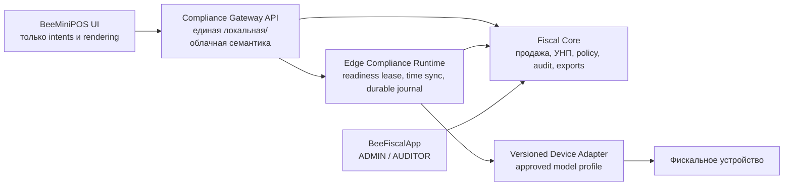
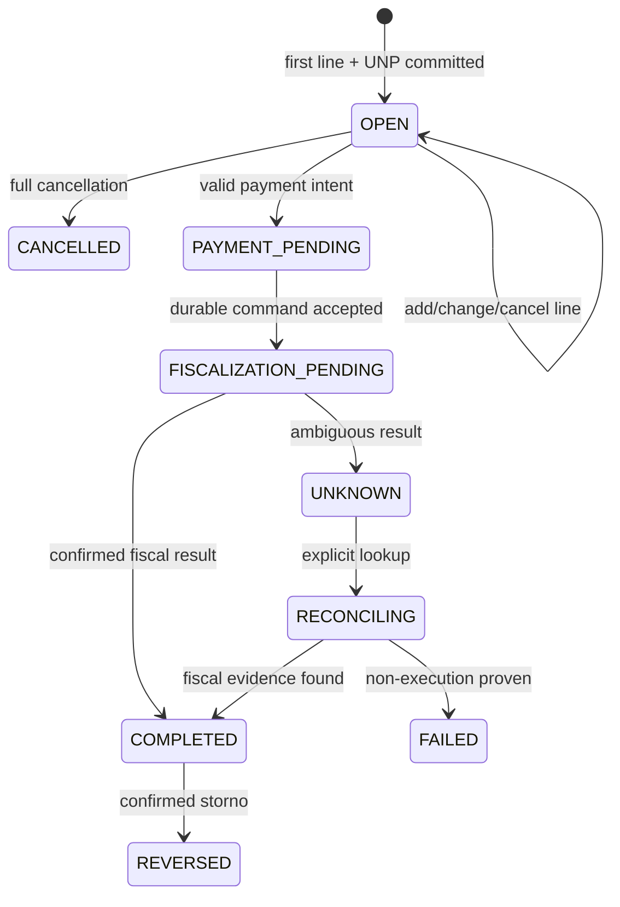

# Техническое задание: устранение разрывов SUPTO и включение профиля BG-014

## 0. Паспорт документа

| Поле | Значение |
|---|---|
| Документ | Исполнимый план модернизации Fiscalisation / BeeMiniPOS до полного профиля SUPTO |
| Нормативный baseline | `/Users/freelancer/Documents/Beeloy/Fiscalisation/docs/SUPTO/index.md` |
| Исходный аудит | `/Users/freelancer/Documents/Beeloy ERP/SUPTO_ARCHITECTURE_COMPLIANCE_AUDIT.md` |
| Целевой профиль | `BG_SUPTO_FULL` / `BG-014 = PASS` |
| Текущий профиль | `BG_MVP_FUNCTIONAL_NONPROD`; `BG-014 = EXCLUDED_MVP`; PILOT/PROD `NO_GO` |
| Формат | Markdown-ТЗ, декомпозированное для последовательной кодогенерации |
| Дата | 2026-08-10 |
| Язык требований | Русский; кассовый и административный UI — болгарский |

> Документ задаёт программную архитектуру, изменения контрактов, схем данных, алгоритмы, тесты и evidence gates. Он не заменяет декларацию производителя, заключение болгарского специалиста, испытания на физическом ФУ, регистрацию типа ФУ или решения НАП/БИМ.

---

# 1. Цель, результат и граница работ

## 1.1. Цель

Перевести систему из функционального non-production MVP в архитектуру, в которой требования `docs/SUPTO/index.md` являются сквозными, машинно проверяемыми инвариантами, а профиль `BG-014` больше не исключён и может получить `PASS` после закрытия software, HIL и legal evidence.

## 1.2. Обязательный конечный результат

Система считается подготовленной к строгому SUPTO review, только если:

1. Продажа создаётся не позднее ввода первого товара.
2. УНП атомарно выдаётся при создании продажи и первой строки.
3. УНП имеет формат `ИН-ФУ–КОД-ОПЕРАТОРА–ПОРЯДКОВЫЙ-НОМЕР`.
4. Первая часть УНП берётся из подтверждённого восьмисимвольного ИН ФУ, а не из UUID рабочего места.
5. УНП отображается в POS с первой принятой строки.
6. Все изменения открытой продажи сохраняются append-only событиями.
7. Проверка ФУ выполняется при запуске рабочего места, открытии продажи и фискализируемом платеже.
8. Для открытия продажи действует максимум двухчасовое readiness lease; перед платежом выполняется свежая проверка.
9. Время ФУ сверяется и при необходимости синхронизируется при запуске или минимум раз в рабочий день.
10. POS не выбирает фискальный транспорт и не формирует vendor/Edge fiscal command.
11. Online и offline пути исполняют одну canonical state machine и одинаковые compliance-инварианты.
12. Завершённая продажа не изменяется и не удаляется; исправление — только сторно.
13. Audit, архив, exports 18.x и AUDITOR profile покрыты машинными тестами.
14. Production build не содержит доступного test/training/simulator/STUB режима.
15. Для каждого поддерживаемого ФУ существует одобренный `DeviceComplianceProfile` с HIL evidence.
16. `BG-014` не может получить `PASS` локальным изменением JSON: статус вычисляется из evidence manifest.
17. POS создаёт только технические surrogate UUID для корреляции запросов; он не генерирует УНП, номера продаж, документов, чеков, сторно, смен или иные юридически значимые идентификаторы.
18. Все regulatory identifiers выдаются Fiscal Middleware по активному, версионированному профилю страны.
19. Связь `POS surrogate UUID ↔ regulatory identifiers` сохраняется неизменяемо в БД, audit, exports и reconciliation evidence.
20. Формат, область уникальности, последовательность и lifecycle юридических идентификаторов не hardcode-ятся под Болгарию в POS или общем доменном коде.

## 1.3. Не является целью

- обещание поддержки буквально всех существующих кассовых аппаратов;
- включение склада, поставок или электронных чеков без отдельного scope decision;
- автоматическое получение юридического одобрения только программными тестами;
- перенос бизнес-логики SUPTO в мобильный UI;
- использование simulator как production evidence.

---

# 2. Operating Review scorecard: исходное и целевое состояние

| Поток | Сейчас | Цель | Gate |
|---|---|---|---|
| BG-014 full profile | `EXCLUDED_MVP` | `PASS` | `make supto-full-acceptance` |
| Открытие продажи | Локальная корзина до checkout | Server/Edge sale с первого товара | `SUPTO-29-09` |
| УНП | `register_id + operator + seq` | `FMIN(8) + operator(4) + seq(7)` | `SUPTO-UNP-GATE` |
| Readiness | В основном перед checkout | startup + open + payment | `SUPTO-READY-GATE` |
| Время ФУ | Parsers без orchestration | Daily sync state machine | `SUPTO-TIME-GATE` |
| POS boundary | Rich fiscal client | Intent/render-only client | `SUPTO-THIN-POS-GATE` |
| Offline | POS строит fiscal envelope | Local Compliance Gateway | `SUPTO-OFFLINE-EQUIVALENCE` |
| Audit | Сильная основа, неполный каталог | Полный Annex 29 event catalog | `SUPTO-AUDIT-GATE` |
| Exports | 18.1–18.5/18.9 реализованы | Field-perfect CSV/XLSX | `SUPTO-EXPORT-GATE` |
| Hardware | Semantic codecs, HIL gaps | Selected approved models only | `SUPTO-HIL-GATE` |
| Release | PROD NO-GO | Signed/scanned/attested | `SUPTO-RELEASE-GATE` |
| Legal | External pending | Signed external evidence | `SUPTO-LEGAL-GATE` |

---

# 3. Архитектурное решение

## 3.1. Целевая схема



## 3.2. Новая граница ответственности

### BeeMiniPOS обязан

- выполнить персональный OIDC login;
- открыть server-bound operator session;
- передать intent первого товара немедленно;
- показывать server-returned УНП, totals, ФУ, readiness и allowed actions;
- передавать intents изменения количества, скидки, отмены, платежа и сторно;
- блокировать локальные действия, отсутствующие в `allowed_actions`;
- отображать `UNKNOWN_REQUIRES_RECONCILIATION` без автоматического повтора;
- не хранить authoritative cart вне кратковременного presentation cache;
- не вычислять окончательные суммы как источник истины;
- не формировать offline fiscal envelope;
- не выбирать REST/BLE/USB маршрут;
- не содержать vendor protocol, fiscal framing и retry policy.
- создавать только UUID v4/v7 как `client_intent_id`, `client_line_id` и `client_payment_intent_id` для идемпотентной корреляции;
- не интерпретировать структуру regulatory identifier, кроме безопасного отображения полученной строки;
- не извлекать из УНП/FMIN/receipt number бизнес-смысл и не использовать их как route key.

### Compliance Gateway обязан

- предоставить одинаковый intent API локально и через HTTPS;
- выбрать Cloud или Edge authority до первого побочного эффекта;
- выдать/проверить readiness lease;
- выполнить атомарное `sale + first line + UNP + audit`;
- заморозить route и authority для операции;
- преобразовать intents в canonical fiscal commands;
- вернуть только canonical states и `allowed_actions`;
- управлять reconciliation и запретом blind retry.

### Fiscal Core обязан

- быть источником истины online-продаж и синхронизированных offline-продаж;
- владеть оператором, ФУ, регистрами, диапазонами УНП и policy version;
- сохранять immutable snapshots объекта, рабочего места, ФУ и оператора;
- обеспечивать append-only audit, exports, archive и auditor access;
- вычислять totals, VAT, discounts и payment balance;
- не принимать mutation, нарушающую state machine или optimistic version.
- владеть генерацией всех юридически значимых идентификаторов через `CountryFiscalProfile`;
- сохранять immutable mapping surrogate UUID к каждому выданному regulatory identifier;
- применять country/profile-specific format, namespace, sequencing, range и retention rules;
- возвращать POS непрозрачные regulatory identifier strings и typed semantic role, не делегируя форматирование клиенту.

### Edge обязан

- владеть локальной authority lease и fenced sequence ranges;
- проверять фактическое ФУ и читать его ИН;
- выдавать signed readiness lease;
- выполнять daily time sync;
- durable-before-device фиксировать команды;
- запрещать неизвестный/неодобренный adapter profile;
- синхронизировать exact append-only events в Core;
- сохранять UNKNOWN при неоднозначном результате;
- не разрешать POS обходить policy.

## 3.3. Архитектурные запреты

Следующие конструкции должны блокироваться тестом или static gate:

- `setCart(...)` как единственный источник незавершённой продажи;
- вызов fiscal BLE/frame/CBOR API из UI-компонента;
- построение УНП через `register_id`;
- создание sale только внутри checkout;
- прямой вызов vendor adapter из POS/MiniPOS backend;
- автоматический fallback REST → BLE после возможной отправки команды;
- повтор UNKNOWN операции тем же или новым operation ID;
- mutation завершённой sale;
- hard delete audit/sale/payment/reversal/export evidence;
- simulator/STUB в PROD;
- ручная установка `BG-014=PASS` без evidence verifier.
- генерация УНП, receipt/document/shift/reversal/regulatory number в POS;
- общий hardcoded regex УНП как EU-wide формат;
- переиспользование одного country profile для другой страны без явной совместимости и evidence;
- изменение или удаление surrogate-to-regulatory mapping.

---

# 4. Канонические доменные модели

## 4.0. Общая модель идентификаторов для EU

Система разделяет два класса идентификаторов.

### Технические surrogate identifiers

Генерируются POS только для корреляции и идемпотентности:

```text
client_intent_id
client_sale_surrogate_id
client_line_id
client_payment_intent_id
client_reversal_intent_id
```

Требования:

- формат UUID v4 или UUID v7 согласно выбранному общесистемному стандарту;
- не имеют юридического смысла;
- не печатаются как обязательный фискальный номер;
- не заменяют УНП, номер фискального документа, смены или сторно;
- уникальны в пределах tenant и source application instance;
- используются как idempotency/correlation keys;
- после принятия middleware связываются с server IDs и regulatory IDs.

### Юридически значимые identifiers

Генерируются или подтверждаются исключительно Fiscal Middleware:

```text
regulatory_sale_id
country_sale_number / УНП
fiscal_device_number
fiscal_document_number
receipt_number
reversal_document_number
shift_number
invoice/credit-note regulatory reference
export/declaration identifiers, если регулируются профилем страны
```

Их формат и правила задаёт `CountryFiscalProfile`, а не POS.

## 4.0.1. `CountryFiscalProfile`

```json
{
  "country_code": "BG",
  "profile_id": "bg-supto-full",
  "profile_version": "2026-08-10.1",
  "effective_from": "2026-08-10T00:00:00Z",
  "effective_to": null,
  "currency": "EUR",
  "timezone": "Europe/Sofia",
  "identifier_schemes": {
    "SALE": "BG_UNP_V1",
    "REVERSAL": "BG_STORNO_V1",
    "SHIFT": "BG_SHIFT_DEVICE_ASSIGNED",
    "RECEIPT": "BG_FISCAL_DEVICE_ASSIGNED"
  },
  "ruleset_hash": "sha256",
  "evidence_manifest_id": "uuid",
  "status": "APPROVED_FOR_PROD"
}
```

Профиль обязан определять для каждого identifier type:

- authority: middleware, Edge, ФУ или внешний государственный сервис;
- входные поля и их trusted sources;
- точный формат и encoding;
- область уникальности;
- последовательность, шаг, диапазоны и fencing;
- момент выдачи;
- возможность пропуска номера и запрет переиспользования;
- immutable/mutable lifecycle;
- правила связывания с original document;
- правила отображения, печати, экспорта и хранения;
- offline policy;
- effective dates и миграцию версии;
- обязательные software/HIL/legal evidence.

Country profile не является произвольным plugin/script. Он поставляется как подписанный, allowlisted и декларационно учтённый policy bundle. Неизвестный, просроченный или неподтверждённый профиль блокирует фискальную операцию.

## 4.0.2. `RegulatoryIdentifierBinding`

```json
{
  "binding_id": "uuid",
  "tenant_id": "tenant",
  "country_code": "BG",
  "country_profile_id": "bg-supto-full",
  "country_profile_version": "2026-08-10.1",
  "source_system": "BeeMiniPOS",
  "source_app_instance_id": "uuid",
  "surrogate_type": "CLIENT_SALE",
  "surrogate_id": "uuid",
  "resource_type": "SALE",
  "resource_id": "server-uuid",
  "regulatory_identifier_type": "UNP",
  "regulatory_identifier": "AB123456–A001–0000001",
  "authority_owner": "FISCAL_CORE",
  "issued_at": "RFC3339",
  "event_id": "uuid",
  "binding_hash": "sha256"
}
```

Инварианты binding:

- append-only и tenant-scoped;
- один surrogate может иметь несколько regulatory identifiers разных semantic types, но не двух активных идентификаторов одного типа без compensating legal event;
- один regulatory identifier не может принадлежать двум ресурсам в своей country-defined uniqueness scope;
- повтор того же intent возвращает существующий binding;
- конфликт payload для существующего surrogate/idempotency key отклоняется;
- mapping присутствует в audit и SUPTO exports;
- offline mapping синхронизируется атомарно с sale/events/allocations;
- профиль и его версия immutable для уже выданного identifier.

## 4.1. Новые value objects

### `FiscalDeviceNumber`

```text
Тип: string
Длина: ровно 8 символов
Источник: фактический ответ ФУ + проверенный DeviceComplianceProfile
Immutable: да, после открытия продажи
Запрещено: UUID рабочего места, внутренний device_id, derived alias
```

### `OperatorCode`

```text
Тип: string
Pattern: ^[A-Za-z0-9]{4}$
Источник: активный Fiscal operator того же tenant
```

### `UNP`

```text
Canonical: {fiscal_device_number}–{operator_code}–{sequence:07d}
Separator: единый нормативно выбранный символ; сериализация фиксируется golden vector
Sequence: 1..9_999_999
Immutable: да
Unique: tenant + unp
```

`UNP` является реализацией схемы `BG_UNP_V1`, а не универсальным EU-форматом. Другие страны реализуют отдельные identifier schemes за тем же интерфейсом, не изменяя POS.

### `ReadinessLease`

```json
{
  "lease_id": "uuid",
  "tenant_id": "tenant",
  "location_id": "uuid",
  "register_id": "uuid",
  "workstation_id": "uuid",
  "fiscal_device_id": "uuid",
  "fiscal_device_number": "AB123456",
  "adapter_profile_id": "uuid",
  "ready": true,
  "verified_at": "RFC3339",
  "valid_for_open_sale_until": "RFC3339 <= verified_at + 2h",
  "requires_payment_recheck": true,
  "clock_sync_business_date": "YYYY-MM-DD",
  "clock_drift_seconds": 0,
  "policy_version": "string",
  "binding_version": 42,
  "signature": "base64url"
}
```

### `UNPRangeLease`

```json
{
  "range_lease_id": "uuid",
  "tenant_id": "tenant",
  "fiscal_device_number": "AB123456",
  "owner_id": "edge-or-core",
  "from": 1000001,
  "to": 1099999,
  "next": 1000001,
  "fencing_token": 7,
  "issued_at": "RFC3339",
  "expires_at": "RFC3339",
  "status": "ACTIVE"
}
```

## 4.2. Sale aggregate

Минимальная модель:

```text
Sale
  id
  tenant_id
  external_id
  client_sale_surrogate_id
  country_code
  country_profile_id
  country_profile_version
  location_snapshot
  workstation_snapshot
  fiscal_device_snapshot {device_id, FMIN, FM number, vendor, model, firmware}
  operator_snapshot {id, code, two names, roles}
  unp
  regulatory_identifiers[]
  state
  version
  policy_version
  readiness_lease_id
  authority_owner
  authority_fencing_token
  opened_at
  completed_at?
  lines[]
  payments[]
  reversal_links[]
  allowed_actions[]
```

## 4.3. State machine продажи



Инварианты:

- `OPEN` не существует без `UNP` и минимум одной original/cancelled line event;
- `COMPLETED` не изменяет lines/payments;
- `UNKNOWN` запрещает new payment, cancel, replacement sale на том же intent;
- переход из `UNKNOWN` выполняет lookup, а не повтор driver command;
- `REVERSED` сохраняет original sale и original fiscal reference;
- каждое изменение увеличивает version и создаёт audit event.

---

# 5. Контракты API

## 5.1. Общие правила

Каждая mutation:

- требует `Authorization: Bearer`;
- требует `X-Api-Version`;
- требует `Idempotency-Key` 16..255;
- для существующего aggregate требует `If-Match`;
- выполняет request schema validation до handler;
- возвращает canonical Problem Details;
- сохраняет replay до необратимого side effect;
- возвращает `ETag`, `allowed_actions` и authoritative projection.
- принимает POS UUID только в явно названных surrogate/correlation полях;
- никогда не принимает от POS значение поля, authority которого по country profile принадлежит middleware/Edge/ФУ;
- возвращает `regulatory_identifiers[]` как непрозрачные значения с `type`, `value`, `country`, `scheme`, `profile_version`;
- фиксирует binding в той же транзакции, что и выдачу identifier и создание доменного ресурса.

## 5.2. Новые/изменённые endpoints

### Рабочее место

```text
POST /public/v1/workstations/{id}/sessions
GET  /public/v1/workstations/{id}/readiness
POST /public/v1/workstations/{id}/readiness:refresh
POST /public/v1/workstations/{id}/clock-sync
```

### Продажа

```text
POST /public/v1/sales:open-with-line
GET  /public/v1/sales/{sale_id}
POST /public/v1/sales/{sale_id}/lines
PATCH /public/v1/sales/{sale_id}/lines/{line_id}
POST /public/v1/sales/{sale_id}/lines/{line_id}:cancel
POST /public/v1/sales/{sale_id}:cancel
POST /public/v1/sales/{sale_id}/payment-intents
POST /public/v1/sales/{sale_id}:reverse
```

### Операции

```text
GET  /public/v1/operations/{operation_id}
POST /public/v1/operations/{operation_id}:reconcile
```

## 5.3. `sales:open-with-line`

Request:

```json
{
  "client_sale_surrogate_id": "uuid",
  "workstation_id": "uuid",
  "operator_session_id": "uuid",
  "line": {
    "line_id": "uuid",
    "product_code": "SKU",
    "name": "Артикул на български",
    "quantity": "1.000",
    "unit_price": {"amount": "10.00", "currency": "EUR"},
    "tax_group": "B",
    "discount": {"amount": "0.00", "currency": "EUR"}
  }
}
```

Atomic response:

```json
{
  "sale_id": "uuid",
  "external_id": "...",
  "unp": "AB123456–A001–0000001",
  "regulatory_identifiers": [
    {
      "type": "SALE",
      "scheme": "BG_UNP_V1",
      "value": "AB123456–A001–0000001",
      "country_code": "BG",
      "profile_version": "2026-08-10.1"
    }
  ],
  "state": "OPEN",
  "version": 1,
  "fiscal_device_number": "AB123456",
  "readiness": {"ready": true, "valid_for_open_sale_until": "..."},
  "totals": {"gross": {"amount": "10.00", "currency": "EUR"}},
  "lines": [],
  "allowed_actions": ["ADD_LINE", "CHANGE_LINE", "CANCEL_LINE", "CANCEL_SALE", "PAY"]
}
```

Транзакция должна атомарно:

1. проверить operator/workstation/shift;
2. проверить readiness lease и daily clock sync;
3. lock sequence range;
4. выделить sequence;
5. построить и проверить УНП;
6. сохранить sale snapshot;
7. сохранить first line event;
8. сохранить audit event `SALE_OPENED`;
9. сохранить `RegulatoryIdentifierBinding` между POS surrogate UUID, server sale ID и УНП;
10. commit;
11. только затем вернуть `201`.

При любой ошибке не должно оставаться выделенного, но невидимого номера без audit. Если sequence уже был durable-reserved, записать `UNP_RESERVED_ABORTED` и не переиспользовать номер.

## 5.4. Payment intent

POS передаёт только намерение оплаты. Core:

- повторно проверяет ФУ непосредственно перед execution;
- проверяет sale version/state/balance;
- серверно вычисляет split remainder;
- сохраняет `PAYMENT_PENDING + EXECUTING operation`;
- фиксирует выбранный route до side effect;
- отправляет один canonical command;
- возвращает `COMPLETED`, `FAILED` или `UNKNOWN`.

## 5.5. Backward compatibility

- старый `POST /orders/{id}/checkout` объявить deprecated;
- запретить ему создавать первую Fiscal sale в `BG_SUPTO_FULL`;
- в transition profile он должен вызывать новый orchestration только для уже существующей sale;
- старые UUID-based УНП не мигрировать в валидные: пометить legacy/non-SUPTO evidence;
- OpenAPI overlay не должен скрывать новый бизнес-контракт; canonical source требуется обновить через reviewed contract diff.

---

# 6. Изменения БД и миграции

## 6.1. Новые таблицы Fiscal

```text
fiscal_device_identities
country_fiscal_profiles
country_identifier_schemes
regulatory_identifier_bindings
readiness_leases
device_clock_sync_events
unp_range_leases
unp_allocations
sale_events
operator_security_events
supto_evidence_manifests
device_compliance_profiles
```

## 6.2. Ключевые constraints

```sql
CHECK (fiscal_device_number ~ '^[A-Za-z0-9]{8}$')
CHECK (operator_code ~ '^[A-Za-z0-9]{4}$')
CHECK (unp_sequence BETWEEN 1 AND 9999999)
UNIQUE (tenant_id, unp)
UNIQUE (tenant_id, fiscal_device_number, unp_sequence)
UNIQUE (tenant_id, source_system, source_app_instance_id, surrogate_type, surrogate_id, regulatory_identifier_type)
UNIQUE according to country-profile identifier scope
EXCLUDE overlapping ACTIVE ranges for same tenant + FMIN
```

Конкретный regex полного УНП должен учитывать утверждённый Unicode/ASCII separator и быть одинаковым в Go, TypeScript, C++ и PostgreSQL golden tests.

## 6.3. Append-only

- `sale_events`, `audit_events`, `clock_sync_events`, `unp_allocations` не имеют public UPDATE/DELETE;
- `regulatory_identifier_bindings` не имеет runtime UPDATE/DELETE;
- runtime DB role получает только INSERT/SELECT;
- corrections — compensating events;
- destructive migration требует отдельного offline-approved procedure;
- retention/partitioning не нарушают доступ к архиву.

## 6.4. Миграционный порядок

1. Добавить таблицы и constraints без переключения profile.
2. Ввести dual-write в старые projections и новые events.
3. Запустить reconciliation report старых и новых projections.
4. Включить typed-only read для нового SUPTO aggregate.
5. Переключить POS на new open-first-line API.
6. Запретить legacy checkout-first flow.
7. Отключить dual-write после двух чистых full regressions и rollback window.

Rollback не должен удалять новые evidence. Он может вернуть reader на старую projection, но не разрешать production SUPTO flow до восстановления инвариантов.

---

# 7. Изменения по компонентам

## 7.1. BeeMiniPOS

### Удалить или изолировать

- authoritative local cart lifecycle;
- создание order/lines только внутри checkout;
- `fiscalCheckout` route selection из UI;
- построение `OfflineSaleInput`;
- прямой `sendFiscalCommandAndWait` для продажи;
- вычисление authoritative total/split remainder;
- direct readiness decision.
- любое создание или форматирование regulatory identifiers.

### Добавить

- `useOpenSaleProjection()`;
- генерацию только surrogate UUID для intent/line/payment/reversal correlation;
- команда `openWithFirstLine(product)`;
- optimistic UI только с состоянием `PENDING_SERVER_ACCEPTANCE`;
- показ строки как принятой только после response с УНП;
- постоянная строка `УНП`, ФУ и lease freshness;
- UI на болгарском для всех canonical Problem codes;
- recovery открытой продажи по operator + workstation + shift;
- блокирующий reconciliation screen;
- minimum version enforcement до login/sale.
- renderer `regulatory_identifiers[]`, не зависящий от внутреннего формата страны;

### UI acceptance

- первый tap товара вызывает ровно одну mutation;
- при failure товар не остаётся как открытая продажа;
- УНП виден после первого успешного response;
- reload восстанавливает sale/УНП;
- local storage не содержит access/refresh token, private key или authoritative sale;
- local storage не содержит автономно сгенерированный УНП/receipt/storno/shift number;
- повтор surrogate UUID возвращает тот же server resource и regulatory binding;
- кнопки рендерятся только из `allowed_actions`;
- UNKNOWN не позволяет начать новую оплату.

## 7.2. MiniPOS backend

- хранить local presentation/order linkage, но не создавать Fiscal sale при checkout;
- создать mapping `minipos_order_id ↔ fiscal_sale_id ↔ UNP` при первом товаре;
- все line mutations сначала подтверждаются Fiscal/Compliance Gateway;
- локальная projection обновляется из authoritative response;
- webhook/polling остаются delivery mechanisms, но не источником state semantics;
- operator session связывается с Fiscal operator code и app instance;
- запрещена локальная employee authority без активного Fiscal operator.

## 7.3. Fiscal backend

- ввести `UNP` package/value object;
- ввести `CountryFiscalProfile`, `IdentifierScheme` и `RegulatoryIdentifierBinding` packages;
- перенести генерацию всех regulatory identifiers за interface `CountryIdentifierAuthority`;
- заменить sequence key `tenant+register` на `tenant+FMIN+range_owner`;
- добавить atomic `OpenSaleWithFirstLine` repository operation;
- хранить readiness lease reference и immutable FMIN snapshot;
- реализовать sale event catalog;
- реализовать payment preflight with fresh device check;
- добавить archive/current unified query boundary;
- расширить audit filters, включая action/type;
- закрыть exports field-by-field.
- добавить signed country-policy loading, effective dating и fail-closed selection;
- обеспечить, что BG-specific code не вызывается напрямую вне BG profile adapter.

## 7.4. Edge Agent

- добавить `ComplianceGateway` process/API;
- получить signed offline authority bundle;
- реализовать `ReadinessManager`;
- реализовать `ClockSyncManager`;
- реализовать `UNPRangeAllocator` с fencing;
- принимать POS intents, а не готовые fiscal commands;
- формировать canonical sale/payment/storno commands локально;
- сохранять sale event до device call;
- синхронизировать exact events и allocations;
- сделать boot recovery lookup-only для ambiguous command.
- использовать country policy bundle для локальной генерации только тех identifiers, authority которых делегирована Edge;
- синхронизировать surrogate/server/regulatory bindings в одной signed batch chain;
- запретить генерацию при истёкшем policy bundle или исчерпанном range lease.

## 7.5. Protocol abstraction

- добавить обязательные capability interfaces: identity, readiness, get/set time, open receipt with UNP, line, payment, cancel, storno, last document, reports/KLEN;
- запретить profile activation при отсутствии обязательной capability;
- зафиксировать codepage/length limits;
- добавить model+firmware golden vectors;
- разделить `Supported`, `Optional`, `Privileged`, `Excluded`;
- не считать command registry coverage доказательством HIL.

## 7.6. BeeFiscalApp

- экран SUPTO profile/evidence;
- просмотр readiness и clock sync history;
- управление FMIN/range только через контролируемый workflow;
- audit filters: period/operator/action/UNP/object;
- AUDITOR read-only current+archive+exports+configuration;
- model compliance profile и внешние evidence links;
- болгарский UI и экспортируемое руководство.

---

# 8. Полный каталог обязательного аудита

Минимальные event types:

```text
LOGIN_SUCCEEDED
LOGIN_FAILED
LOGOUT
OPERATOR_CREATED
OPERATOR_CHANGED
OPERATOR_ROLE_CHANGED
OPERATOR_DEACTIVATED
WORKSTATION_STARTED
DEVICE_READINESS_CHECKED
DEVICE_IDENTITY_MISMATCH
DEVICE_CLOCK_CHECKED
DEVICE_CLOCK_SYNCHRONIZED
COUNTRY_PROFILE_ACTIVATED
COUNTRY_PROFILE_REJECTED
REGULATORY_IDENTIFIER_BOUND
UNP_RANGE_ISSUED
UNP_ALLOCATED
UNP_RESERVED_ABORTED
SALE_OPENED
SALE_LINE_ADDED
SALE_LINE_CHANGED
SALE_LINE_CANCELLED
SALE_CANCELLED
PAYMENT_INTENT_CREATED
FISCAL_COMMAND_DURABLE
FISCAL_COMMAND_SENT
FISCAL_COMMAND_RESULT
FISCAL_RESULT_UNKNOWN
RECONCILIATION_STARTED
RECONCILIATION_RESOLVED
SALE_COMPLETED
REVERSAL_REQUESTED
REVERSAL_FISCALIZED
NOMENCLATURE_CREATED
NOMENCLATURE_CHANGED
EXPORT_REQUESTED
EXPORT_DOWNLOADED
CONFIGURATION_CHANGED
ADAPTER_ACTIVATED
SOFTWARE_UPDATED
```

Каждое событие содержит:

- tenant;
- event ID;
- actor subject, operator ID/code/name;
- timestamp UTC с точностью не хуже секунды;
- local business time Europe/Sofia для deadline rules;
- action/object/before/after;
- УНП для sale cancel/storno и связанных действий;
- workstation/device/FMIN;
- correlation/operation/idempotency IDs;
- previous hash/current hash;
- signature, если применяется;
- source component/version.
- country/profile/scheme version для любого regulatory identifier event;
- POS surrogate UUID и server resource ID для сквозной корреляции.

---

# 9. Экспорт, архив и auditor profile

## 9.1. Export types

Обязательные golden schemas:

- `SUPTO_18_1_SUMMARY_SALES`;
- `SUPTO_18_2_PAYMENTS`;
- `SUPTO_18_3_LINES`;
- `SUPTO_18_4_REVERSALS`;
- `SUPTO_18_5_CANCELLATIONS`;
- `SUPTO_18_9_NOMENCLATURES`.

Поставки/склад (`18.6–18.8`) должны иметь feature flag `NOT_IN_PRODUCT_SCOPE`, который production gate проверяет против фактических endpoints/tables/UI. При появлении складской функции статус автоматически становится `REQUIRED`.

## 9.2. Field-perfect тестирование

Для каждого export type создать:

- JSON canonical fixture;
- CSV UTF-8 fixture с delimiter/quoting/newline rules;
- XLSX fixture и cell-by-cell assertion;
- empty period fixture;
- multi-tenant isolation fixture;
- location/FU/workstation/operator filters;
- historic sale-time snapshot fixture после rebind;
- VAT/discount/rounding fixture;
- cancellation/reversal fixture.

## 9.3. Архив

- единый query API скрывает hot/archive storage;
- архив остаётся read-only доступным AUDITOR;
- restore test подтверждает byte-identical export hashes;
- retention period задаётся policy, а не hardcoded UI;
- размещение БД ограничено BG/EU deployment policy evidence.

---

# 10. Стратегия тестирования

## 10.1. Пирамида

1. Value-object/property tests.
2. Domain state-machine tests.
3. Repository transaction/race tests.
4. API contract tests.
5. Component integration tests.
6. Two-compose end-to-end.
7. Fault injection and restart tests.
8. Security tests.
9. Physical HIL/vendor golden tests.
10. Legal/evidence verification gates.

## 10.2. Обязательные тесты УНП

```text
UNP-001 exact 8-4-7 format
UNP-002 reject UUID prefix
UNP-003 reject wrong separator
UNP-004 operator code exactly 4
UNP-005 sequence monotonic by FMIN
UNP-006 independent tenants
UNP-007 disjoint ranges for two SUPTO owners
UNP-008 128+ concurrent opens produce no duplicate
UNP-009 crash after allocation never reuses number
UNP-010 Edge/Core golden formatter equality
UNP-011 restart recovers next sequence
UNP-012 FMIN rebind cannot alter open sale
UNP-013 mismatched physical FMIN blocks sale
UNP-014 UI displays returned УНП
```

## 10.2.1. Country profiles и bindings

```text
ID-001 POS UUID принимается только как surrogate, но не как regulatory ID
ID-002 POS не может передать собственный УНП/receipt/storno number
ID-003 middleware выдаёт BG УНП по BG_UNP_V1
ID-004 другой country profile использует отдельную схему без изменения POS
ID-005 unknown country/profile fail closed
ID-006 expired/not-effective profile fail closed
ID-007 unsigned/tampered policy bundle rejected
ID-008 повтор surrogate UUID возвращает тот же binding
ID-009 тот же surrogate с другим payload вызывает conflict
ID-010 один regulatory ID не связывается с двумя sales
ID-011 binding атомарен с sale+first line+identifier
ID-012 rollback не оставляет видимый orphan binding
ID-013 crash after identifier allocation preserves allocation and binding evidence
ID-014 offline binding синхронизируется без изменения identifier
ID-015 profile upgrade не меняет identifiers старых sales
ID-016 audit содержит surrogate, server ID, regulatory ID и profile version
ID-017 exports содержат требуемую regulatory связь
ID-018 tenant isolation запрещает lookup foreign binding
ID-019 generic Core не содержит BG-format branch вне BG adapter
ID-020 POS bundle/static scan не содержит генератор regulatory identifiers
```

Property tests должны запускать общий contract suite против нескольких test profiles:

- `BG_SUPTO_FULL` — УНП 8-4-7;
- `EU_TEST_PROFILE_ALPHA` — искусственная схема только для проверки pluggability, не production evidence;
- `UNKNOWN/EXPIRED/TAMPERED` — обязательный fail-closed.

Искусственный EU test profile не означает соответствие законодательству конкретной страны.

## 10.3. Открытие продажи

```text
SALE-OPEN-001 first item creates sale before UI acceptance
SALE-OPEN-002 atomic sale+line+UNP+audit
SALE-OPEN-003 no readiness => no sale
SALE-OPEN-004 stale >2h readiness => no sale
SALE-OPEN-005 app restart restores sale
SALE-OPEN-006 remove first line creates cancellation event
SALE-OPEN-007 quantity change preserves before/after
SALE-OPEN-008 two taps/idempotency create one line
SALE-OPEN-009 stale If-Match cannot mutate
SALE-OPEN-010 offline and online projections equivalent
```

## 10.4. Readiness и время

```text
READY-001 startup probes physical ФУ
READY-002 verified FMIN included
READY-003 open allowed within 2h
READY-004 open blocked after 2h
READY-005 payment always fresh-checks
READY-006 unready device blocks only bound workstation
READY-007 rebind invalidates lease
READY-008 firmware/profile change invalidates lease
TIME-001 daily check logged
TIME-002 drift within tolerance no set
TIME-003 drift beyond tolerance performs set+verify
TIME-004 failed set blocks according to policy
TIME-005 phone clock never trusted
TIME-006 clock rollback cannot shorten retention/lease
```

## 10.5. Платёж и ambiguity

```text
PAY-001 exact total required
PAY-002 ordered cash/card split
PAY-003 partial payment carries same УНП
PAY-004 command durable before device call
PAY-005 response loss => UNKNOWN
PAY-006 UNKNOWN retry does not call device
PAY-007 reconciliation finds last document
PAY-008 completed result includes immutable receipt/FMIN
PAY-009 two concurrent payments: one side effect
PAY-010 final commit atomic with receipt and webhook outbox
```

## 10.6. Сторно и отмена

- original sale immutable;
- allowed reason allowlist;
- operator-error deadline Europe/Sofia;
- same УНП in storno command/document;
- original fiscal reference required;
- second reversal rejected;
- physical cash availability/vendor cases;
- printed storno golden comparison.

## 10.7. Security

- OIDC issuer/audience/kid/RS256/expiry/tenant/role/scope;
- app-instance-bound operator session;
- logout revocation survives restart;
- BLE/local gateway authority tenant/location/register/FMIN binding;
- no secrets in logs/storage/bundles;
- idempotency replay cannot cross tenant/operator;
- SSRF/webhook signature/replay/rate limit;
- signed OTA target/model/hardware/profile;
- downgrade and unsupported adapter fail closed;
- PROD rejects simulator, STUB, static token, HTTP trust URLs and wildcard CORS.

## 10.8. HIL

Для каждой model+firmware:

- read FMIN/FM identity;
- readiness and paper/error states;
- get/set time;
- first sale with exact УНП;
- multiple lines, discounts, VAT groups;
- cash/card/split/partial;
- cancel open receipt;
- storno with original reference;
- power loss before/after send;
- response loss and last-document reconciliation;
- X/Z/KLEN/FM reports;
- printed document golden scan/manual verification;
- 72h/7d physical endurance;
- SD/flash corruption/recovery;
- NRA/BIM connectivity topology evidence.

---

# 11. Machine-readable traceability и BG-014 gate

## 11.1. Новый реестр

Создать `contracts/supto-annex29-trace.json`.

Каждая запись:

```json
{
  "id": "SUPTO-29-09",
  "title": "Генерация УНП при первом товаре",
  "status": "FAIL",
  "owner": "fiscal-core",
  "invariants": ["sale+first-line+UNP atomic", "FMIN 8 chars"],
  "apis": ["openSaleWithFirstLine"],
  "db_constraints": ["unp_format", "unp_unique"],
  "unit_tests": [],
  "integration_tests": [],
  "e2e_tests": [],
  "hil_evidence": [],
  "legal_evidence": [],
  "production_blocked": true
}
```

Дополнительно создать `contracts/country-fiscal-profiles.json`, содержащий только allowlisted profiles и ссылки на signed policy/evidence manifests. Каждая страна получает собственную regulatory trace matrix. `supto-annex29-trace.json` относится к BG, а не объявляется универсальным EU regulation registry.

## 11.2. Статусная логика

```text
PASS = software tests PASS
    AND required HIL evidence valid
    AND required legal evidence valid
    AND production profile selected
    AND no expired evidence

PARTIAL = software implementation exists, но часть required evidence отсутствует
EXTERNAL_BLOCKED = software complete, external evidence missing
FAIL = software invariant violated/missing
NOT_APPLICABLE = conditional feature formally absent and absence machine-verified
```

## 11.3. BG-014

`BG-014` должен вычисляться:

```text
BG-014 PASS
  iff every required SUPTO-29-01..24 row is PASS or verified NOT_APPLICABLE
  AND declaration manifest is valid
  AND supported device profiles are APPROVED_FOR_PROD
  AND release evidence is SIGNED_SCANNED_GO
  AND pilot/production external signoffs are valid.
```

Запретить:

- ручное изменение `EXCLUDED_MVP → PASS`;
- self-signed evidence без independently trusted key;
- simulator evidence для HIL row;
- локально сфабрикованные human signatures;
- expired firmware/BIM/service evidence.

---

# 12. Эпики для последовательной кодогенерации

Каждый эпик выполняется отдельной веткой/PR и не начинает зависимый эпик до прохождения exit criteria.

## EPIC-00 — Baseline и governance

**Цель:** зафиксировать текущее поведение и новый trace registry.

Задачи:

1. Добавить `supto-annex29-trace.json` со статусами текущего аудита.
2. Добавить verifier и `make supto-trace-test`.
3. Зафиксировать current checkout-first flow негативным тестом, который после миграции должен измениться.
4. Добавить decision records: thin POS, local gateway, FMIN-based UNP, offline ranges.
5. Добавить feature-scope manifest: inventory/supply/e-receipt.

Exit:

- registry охватывает 1–24;
- каждый row имеет owner/evidence/test paths;
- BG-014 остаётся FAIL/EXCLUDED и production blocked.

## EPIC-01 — UNP value object и DB foundation

Задачи:

1. Реализовать formatter/parser/validator в Go.
2. Добавить shared golden JSON vectors.
3. Реализовать TypeScript display parser и C++ adapter tests по тем же vectors.
4. Добавить FMIN identity/range/allocation tables.
5. Добавить constraints/indexes/RLS.
6. Реализовать allocator с transaction lock/CAS/fencing.
7. Ввести общий `CountryIdentifierAuthority` и BG adapter `BG_UNP_V1`.
8. Добавить immutable surrogate-to-regulatory binding repository.
9. Добавить signed/effective-dated country profile registry.

Exit:

- UNP-001..013 и ID-001..019 PASS;
- UUID prefix rejected;
- concurrent allocator PASS на real PostgreSQL.

## EPIC-02 — Readiness lease

Задачи:

1. Domain model и signed serialization.
2. Edge physical probe + FMIN read.
3. startup/open/payment policies.
4. invalidation on rebind/profile/firmware/session expiry.
5. API/UI projection.

Exit: READY-001..008 PASS software; HIL rows external-blocked.

## EPIC-03 — Time synchronization

Задачи:

1. Trusted time source abstraction.
2. device get/set time capability.
3. daily business-date scheduler.
4. drift policy and post-set verification.
5. append-only clock events and admin view.

Exit: TIME-001..006 PASS + selected-device HIL.

## EPIC-04 — Atomic open-with-first-line

Задачи:

1. OpenAPI operation/schema.
2. repository atomic operation.
3. readiness/operator/shift checks.
4. UNP allocation and sale snapshots.
5. audit events and idempotency.
6. fault/race tests.

Exit: SALE-OPEN-001..004,008,009 PASS.

## EPIC-05 — Server-owned open sale lifecycle

Задачи:

1. line add/change/cancel endpoints;
2. compensating event model;
3. authoritative totals;
4. full sale cancellation;
5. recovery/list filters by operator/register/state;
6. `allowed_actions` state-derived only.

Exit: no untracked local mutation; cancellations export correctly.

## EPIC-06 — Thin BeeMiniPOS migration

Задачи:

1. Replace local cart reducer with server projection.
2. First tap → open API.
3. Display УНП/readiness/device.
4. Recovery after restart/re-authentication.
5. Remove fiscal route/command building from UI.
6. Bulgarian error dictionary and accessibility.
7. Оставить в POS только surrogate UUID generation.
8. Удалить/запретить regulatory identifier formatting/generation.
9. Рендерить typed opaque `regulatory_identifiers` из middleware response.

Exit: UI acceptance и ID-020 PASS; static boundary test предотвращает возврат fiscal/regulatory identifier authority в POS.

## EPIC-07 — Local Compliance Gateway

Задачи:

1. Local intent API protected by operator/app/session authority.
2. Same OpenAPI semantics as cloud gateway.
3. Offline authority bundle/range lease.
4. Durable local sale events.
5. Core sync/reconciliation.
6. Route freeze and no-fallback-after-send.
7. Country-profile policy bundle и delegated identifier authority.
8. Atomic surrogate/server/regulatory bindings в offline journal/sync.

Exit: online/offline equivalence suite PASS.

## EPIC-08 — Payment/reconciliation hardening

Задачи:

1. Fresh payment readiness.
2. Server totals/split computation.
3. One durable operation before side effect.
4. Last-document reconciliation per adapter.
5. UNKNOWN UX and operational workflow.

Exit: PAY-001..010 PASS; no duplicate device call under faults.

## EPIC-09 — Cancellation/reversal completeness

Задачи:

1. reason/deadline policies;
2. same-UNP storno binding;
3. original references and snapshots;
4. physical cash/vendor rules;
5. exports/audit.

Exit: software + selected adapter HIL storno golden PASS.

## EPIC-10 — Audit, exports, archive, auditor

Задачи:

1. complete event catalog;
2. action filters;
3. 18.1–18.5/18.9 field-perfect outputs;
4. archive unified access;
5. AUDITOR tenant read-only profile;
6. backup/restore/hash evidence.

Exit: SUPTO-29-15..19 PASS software/deployment evidence staged.

## EPIC-11 — Document/template policy

Задачи:

1. inventory non-fiscal outputs;
2. server-owned templates;
3. banned fiscal wording validator;
4. prohibit customer-editable template code;
5. test no service bon for customer sale.

Exit: SUPTO-29-11 and 14 PASS.

## EPIC-12 — Device compliance profiles и HIL

Задачи:

1. model+firmware profile schema;
2. required capability matrix;
3. adapter activation gate;
4. vendor golden vectors;
5. physical HIL runner/evidence packaging;
6. approved-type/service/BIM links.

Exit: минимум один конкретный production track APPROVED; остальные disabled.

## EPIC-13 — Release, deployment и declaration evidence

Задачи:

1. signed release/provenance/SBOM;
2. zero Critical/High accepted scan;
3. real OIDC/passwordless evidence;
4. BG/EU residency evidence;
5. manuals, DB schema, module inventory, ports/channels;
6. Appendix 30/31/32 package;
7. version/declaration change workflow.

Exit: external reviewers provide genuine signatures/evidence.

## EPIC-14 — BG-014 activation

Задачи:

1. run two consecutive full regressions;
2. run selected hardware HIL;
3. verify all Annex 29 rows;
4. generate immutable acceptance pack;
5. obtain Product/Engineering/QA/Security/Compliance signoffs;
6. change runtime profile to `BG_SUPTO_FULL` only through signed manifest.

Exit:

- `BG-014=PASS` calculated;
- PILOT GO;
- PROD GO only after external legal/service acceptance.

---

# 13. Правила выполнения плана моделью кодогенерации

Для каждого эпика модель должна:

1. Прочитать этот документ, текущий Annex trace и относящиеся source files.
2. Проверить `AGENTS.md` и dirty worktree.
3. Создать краткий implementation plan с одним активным шагом.
4. Не менять external evidence status.
5. Сначала добавить или обновить failing tests.
6. Реализовать минимальный cohesive change.
7. Не дублировать domain schema между transports.
8. Обновить OpenAPI → generated clients/validators → handlers → domain → persistence → UI.
9. Добавить migration с rollback-safe поведением.
10. Запустить targeted tests, затем mandatory regression subset.
11. Обновить trace row только на фактически доказанный статус.
12. Не помечать HIL/legal PASS симулятором.
13. Сохранить change evidence и перечислить оставшиеся блокеры.
14. Не добавлять country-specific format в POS или generic domain package; использовать country profile adapter.
15. При добавлении страны создавать отдельную regulatory trace matrix и evidence manifest.

Definition of Done для PR:

- contract drift отсутствует;
- unit/race/integration tests PASS;
- negative tests присутствуют;
- tenant isolation доказана;
- idempotency/restart/fault semantics доказаны;
- migrations проверены на clean DB и upgrade DB;
- UI тексты на болгарском;
- документация и trace обновлены;
- production guard не ослаблен;
- нет ручной фальсификации acceptance/evidence.

---

# 14. Риски и обязательные решения

| Риск | Последствие | Решение |
|---|---|---|
| Регулятор считает MiniPOS отдельным источником | Приложения 41/42 | Декларировать единый модульный SUPTO; всё равно хранить raw intent linkage |
| Offline ranges пересекаются | Повтор УНП | Fenced disjoint ranges + DB exclusion constraint |
| FMIN отличается от registry | Неверный УНП/ФУ | Fail closed, identity mismatch audit, service intervention |
| POS остаётся fiscal transport owner | Большая сертификационная поверхность | Local Compliance Gateway |
| Adapter semantic tests принимаются за HIL | Ложный GO | Separate evidence types и verifier |
| Legacy UUID-based УНП | Некорректная история | Не маскировать; маркировать legacy profile |
| Формат BG случайно становится общим EU форматом | Нарушения в других странах | Country-specific identifier schemes за общим interface |
| POS генерирует юридический номер offline | Несогласованные последовательности и расширенная сертификация | Только surrogate UUID в POS; delegated authority исключительно Local Gateway/Edge |
| Потеря связи surrogate ↔ regulatory ID | Невозможна регуляторная трассировка | Atomic immutable binding + audit/export/reconciliation tests |
| Обновление country profile меняет старые номера | Повреждение исторических данных | Immutable profile version snapshot на binding/resource |
| Time set ограничен моделью/сервисом | Daily requirement не закрыт | Profile capability + operational fail-closed policy |
| Новый driver изменяет декларируемый продукт | Требуется новая декларация | Versioned profile/release impact workflow |
| Архив недоступен новой версии приложения | Нарушение п.17 | Stable archive query contract + restore compatibility tests |
| Security advisory без исправления | Release NO-GO | Upgrade/remediation or externally approved exception; не self-waiver |

Обязательные решения до EPIC-04:

1. Точный символ-разделитель УНП и его byte representation.
2. Допустимый alphabet восьмисимвольного ИН ФУ.
3. Drift tolerance и поведение при невозможности set time.
4. Local Gateway deployment form на Android/iOS/Web.
5. Выбранный первый production hardware track.
6. Входят ли inventory/supply/e-receipt в продукт.

---

# 15. Финальные acceptance-команды

Целевой Makefile surface:

```bash
make supto-trace-test
make supto-unp-test
make country-profile-test
make regulatory-identifier-binding-test
make supto-sale-lifecycle-test
make supto-readiness-test
make supto-time-test
make supto-audit-test
make supto-export-test
make supto-offline-equivalence-test
make supto-security-test
make supto-hil-verify EVIDENCE_DIR=/trusted/hil
make supto-release-verify EVIDENCE_DIR=/trusted/release
make supto-legal-verify EVIDENCE_DIR=/trusted/legal
make supto-full-acceptance
```

`make supto-full-acceptance` обязан завершаться ошибкой, если:

- существует FAIL/PARTIAL/EXTERNAL_BLOCKED required row;
- `BG-014` всё ещё excluded;
- выбран simulator/STUB;
- отсутствует selected approved device profile;
- release/IdP/HIL/legal evidence невалидно или просрочено;
- найден checkout-first/local-cart authority path;
- найден UUID-based УНП;
- POS генерирует или форматирует regulatory identifier;
- отсутствует immutable binding POS surrogate UUID ↔ server resource ↔ regulatory identifier;
- country profile неизвестен, не подписан, не effective или не имеет country-specific evidence;
- не выполнены два последовательных clean full regression;
- human signoff отсутствует или создан локальным automation.

---

# 16. Итоговый порядок выполнения

```text
EPIC-00 Trace/governance
  → EPIC-01 Country identifier authority + BG UNP foundation
  → EPIC-02 Readiness
  → EPIC-03 Time sync
  → EPIC-04 Atomic first-line open
  → EPIC-05 Sale lifecycle
  → EPIC-06 Thin POS
  → EPIC-07 Offline Gateway
  → EPIC-08 Payment/reconciliation
  → EPIC-09 Cancellation/storno
  → EPIC-10 Audit/export/archive
  → EPIC-11 Document policy
  → EPIC-12 Device profiles/HIL
  → EPIC-13 Release/declaration
  → EPIC-14 BG-014 activation
```

Критический путь: `UNP → readiness/time → first-line sale → thin POS → offline equivalence → HIL/legal evidence`.

Главный архитектурный критерий: мобильный POS больше не реализует SUPTO-решения самостоятельно. Он выражает намерения и отображает решения Compliance Gateway/Core. Все юридически значимые инварианты сосредоточены в повторно используемом промежуточном слое, но конкретные UI release, adapters, firmware и deployment profile остаются частью декларируемой интегрированной системы.
