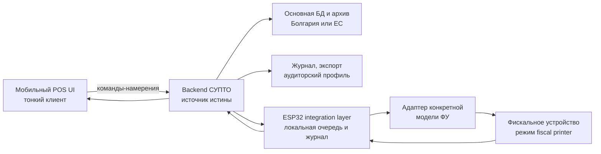

Ниже — архитектурная матрица для обычного полного режима СУПТО по действующей на август 2026 года редакции Наредбы № Н‑18, прежде всего Приложения №29, а также ст. 52в–52л и Приложений №31, 32, 41 и 42.

Главный вывод: почти всю юридически значимую логику можно вынести из мобильного POS в промежуточный слой и backend. Но мобильное приложение останется декларируемым модулем СУПТО и должно соблюдать несколько требований интерфейса и безопасности.

Это не индивидуальное юридическое заключение. Перед декларацией желательно получить письменную проверку болгарского специалиста по Н‑18.

## 1. Рекомендуемая граница системы



Распределение ответственности:

| Компонент | Роль |
|---|---|
| Мобильный UI | Идентификация оператора, ввод намерения, отображение УНП, статусов, ошибок и результата |
| Backend | Единственный источник истины для продаж, операторов, прав, платежей, журналов, экспорта и архива |
| ESP32 | Надёжный локальный шлюз к ФУ, проверка готовности, выполнение команд, локальный append-only журнал и восстановление после обрыва |
| Драйвер ФУ | Преобразование единого протокола в команды конкретной модели |
| Фискальное устройство | Формирование фискального документа, КЛЕН, фискальная память и передача данных НАП в пределах сертифицированной модели |

Не рекомендуется делать ESP32 единственным постоянным хранилищем: требования к архиву, экспорту, аудиторскому доступу и срокам хранения делают backend практически обязательным.

---

# 2. Полная матрица требований Приложения №29

Обозначения:

- `UI` — обязательно проявляется в мобильном приложении;
- `CORE` — backend/центральный слой СУПТО;
- `EDGE` — ESP32 и драйвер ФУ;
- `ADMIN` — административный или аудиторский web-интерфейс;
- `OPS` — организационная процедура.

## 2.1. Интерфейс и целостность

### 1. Интерфейс на болгарском языке

**Требование:** программное обеспечение должно поддерживать интерфейс на болгарском.

**Где реализовать:**

- `UI`: все кассовые экраны, статусы, ошибки и подтверждения;
- `ADMIN`: административные и аудиторские экраны;
- технический API может использовать английские идентификаторы.

Нельзя оставить мобильный POS только на русском или английском.

### 2. Полнота и целостность данных

**Требование:** система обеспечивает полноту и интегритет создаваемых данных.

**Где:** `CORE + EDGE`.

Практическая реализация:

- транзакции БД;
- append-only события;
- уникальные идентификаторы и идемпотентность;
- запрет физического удаления;
- контроль последовательности событий;
- криптографические хеши/подписи;
- подтверждение синхронизации backend ↔ ESP32;
- резервные копии;
- обнаружение пропущенных событий;
- reconcilliation с ФУ.

Подпись ключом device identity полезна, но сама по себе не выполняет всё
требование. В текущей архитектуре ESP32-S3 генерирует P-256 keypair при первой
инициализации; внешний ATECC608A/crypto provider не используется. Защита
закрытого ключа в production обеспечивается Flash Encryption и NVS Encryption.

### 3. Отменено

Пункт 3 Приложения №29 отменён.

### 4. Защита от неавторизованных модулей и изменений

**Требование:** нельзя без разрешения производителя добавлять модули, меняющие функциональность или позволяющие изменять, удалять либо манипулировать БД.

**Где:** `CORE + EDGE + UI + OPS`.

Нужно:

- подписанные релизы UI и firmware;
- Secure Boot и Flash Encryption на ESP32;
- allowlist версий UI, firmware и драйверов;
- подпись конфигурации адаптеров;
- запрет произвольных plugins/scripts;
- серверная проверка версии клиента;
- миграции БД только из подписанного пакета;
- RBAC для административных функций;
- журнал обновлений;
- договорное правило: клиент не устанавливает неавторизованные расширения.

## 2.2. Время, операторы и аутентификация

### 5. Точное время и синхронизация с ФУ

**Требование:** по возможности используется надёжный источник астрономического времени. Время рабочего места и используемого им ФУ синхронизируется при запуске либо минимум один раз в рабочий день.

**Где:** `EDGE`, контроль — `CORE`.

Нужно:

- NTP с несколькими источниками;
- сохранение UTC и локальной зоны;
- проверка отклонения часов ESP32, backend и ФУ;
- синхронизация ФУ при запуске смены/рабочего места;
- минимум одна успешная синхронизация в рабочий день;
- журнал старого времени, нового времени, источника и результата;
- блокировка либо контролируемая ошибка при недопустимом расхождении.

Мобильное время телефона нельзя считать доверенным.

### 6. Обязательные данные операторов

Для каждого оператора:

- уникальный код в системе либо торговом объекте;
- минимум два имени;
- роль/права;
- начало и конец активности каждой роли/права.

**Где:** `CORE + ADMIN`.

UI только получает авторизованную сессию и код оператора.

Для формирования УНП нужен четырёхразрядный код оператора. Если внутренний идентификатор длиннее, должен существовать стабильный mapping на четыре разряда.

### 7. Однозначная аутентификация

**Требование:** каждый оператор должен быть однозначно аутентифицирован.

**Где:** `CORE`, ввод — `UI`.

Допустимы:

- пароль;
- PIN, привязанный к оператору;
- passkey;
- карта сотрудника плюс PIN;
- клиентский сертификат;
- биометрия телефона как локальный unlock защищённой серверной сессии.

Недопустимы:

- общий пользователь «кассир»;
- один PIN для всех;
- выбор имени из списка без секрета;
- передача `operator_id` от UI без серверной проверки сессии.

---

# 3. Связь с фискальным устройством

### 8. Проверка связи и готовности ФУ

Система должна получать в реальном времени:

- готовность ФУ напечатать фискальный чек;
- индивидуальный номер ФУ — ИН.

Проверки обязательны:

1. При запуске рабочего места.
2. При открытии продажи.
3. При платеже, требующем фискальный чек.

**Где:** `EDGE`, решение о блокировке — `CORE`.

Правила:

- если при запуске нет связи/готовности — блокируются открытие продажи и фискализируемая оплата;
- для открытия продажи разрешено использовать ИН ФУ, связь с которым подтверждена в предыдущие два часа;
- после двух часов без новой проверки открытие продаж блокируется;
- перед фискализируемой оплатой требуется актуальная связь и статус готовности;
- блокируется конкретное рабочее место, а не обязательно весь объект.

UI обязан только показать состояние и не предлагать обход.

### 9. Генерация УНП

При вводе информации о продаже генерируется уникальный номер:

```text
ИН-ФУ–КОД-ОПЕРАТОРА–ПОРЯДКОВЫЙ-НОМЕР
XXXXXXXX–ZZZZ–0000001
```

Требования:

- ИН ФУ — 8 символов;
- оператор — 4 разряда;
- номер — 7 арабских цифр;
- разделитель `–` обязателен;
- номер возрастает с шагом 1;
- последовательность ведётся отдельно для каждого ИН ФУ;
- УНП отображается в форме продажи;
- при нескольких СУПТО на одном ФУ каждому выделяется отдельный последовательный диапазон.

**Где:** `CORE`, но только после подтверждения ИН от `EDGE`.

UI не должен самостоятельно генерировать УНП.

#### Момент открытия продажи

Продажа считается введённой не позднее:

- добавления товара/услуги в экранную форму; либо
- записи информации из формы в БД.

Поэтому опасна схема «UI собирает корзину локально, а в backend отправляет только при оплате». Если пользователь уже ввёл товар в кассовую форму, юридически продажа могла быть открыта.

Безопасная модель:

```text
Первый товар → запрос CORE → проверка ФУ → создание продажи и УНП →
ответ UI → отображение строки товара и УНП
```

Для длительных/повторяющихся поставок УНП создаётся при заключении договора либо при формировании обязательства за период.

### 10. Платёж и обязательная команда ФУ

При выборе способа платежа, требующего фискального чека, система обязана:

- послать команду ФУ;
- включить УНП в чек;
- включать тот же УНП в чек каждого частичного платежа;
- включать УНП в сторно-чек.

**Где:** `CORE + EDGE`.

Для старой продажи без УНП используется специальный номер:

```text
OO000000-0000-0000000
```

Первые два символа — латинские `O`, остальные — нули.

Архитектурное правило: UI не должен помечать платеж успешным до получения однозначного результата от ФУ или перехода операции в состояние `UNKNOWN_REQUIRES_RECONCILIATION`.

### 11. Запрет служебных бонов для клиентских заказов

Система не должна печатать «служебные бонове» для клиентских заказов в рамках продажи.

**Где:** `CORE + EDGE`.

Нефискальный кухонный/складской документ должен быть явно нефискальным и не использовать запрещённую терминологию.

---

# 4. Аннулирование, сторно и неизменяемость

### 12. Аннулирование незавершённой продажи

При полном или частичном аннулировании открытой продажи сохраняются:

- аннулированные товары/услуги;
- количество;
- стоимость;
- оператор;
- дата и время;
- УНП;
- желательно причина.

**Где:** `CORE`.

Нельзя обновлять строку «на месте» так, чтобы прежнее значение исчезло. Используйте компенсирующее событие.

### 13. Защита завершённых продаж

Система:

- не имеет функции удаления данных, относящихся к пунктам 15 и 18;
- не изменяет бесследно завершённые продажи;
- поддерживает сторно;
- сохраняет исходные и сторнированные данные.

**Где:** `CORE + DB`.

Рекомендуемая модель:

```text
SALE_COMPLETED
STORNO_REQUESTED
STORNO_FISCALIZED
```

Исходная продажа остаётся неизменной.

### 14. Запрещённые надписи на нефискальных документах

Нефискальные документы не могут содержать слова:

- `Фискален`;
- `Фискална`;
- `Фискално`;
- `Фискални`;
- производные словосочетания.

Исключения касаются названия торговца с организационно-правовой формой и ЕИК, а также наименования товара.

**Где:** `CORE + UI + EDGE`.

Шаблоны документов должны быть закрыты от произвольного редактирования клиентом.

---

# 5. Обязательный журнал операций

### 15. Структурированный аудит

Обязательно сохраняются:

#### Изменения пользователей и прав

- кто выполнил изменение;
- когда;
- описание изменения;
- создание/изменение оператора;
- назначение/изменение роли или прав.

#### Действия операторов

- имя оператора;
- код оператора;
- дата и время до секунды;
- тип действия.

Минимально регистрируются:

- login;
- logout;
- сторно;
- аннулирование;
- изменения номенклатур.

Для сторно и аннулирования — УНП.

**Где:** `CORE`.

Рекомендуется дополнительно журналировать:

- открытие продажи;
- добавление/изменение строки;
- скидку;
- выбор платежа;
- команду ФУ;
- запрос, ответ и статус ФУ;
- повтор команды;
- сбой связи;
- синхронизацию времени;
- обновление firmware;
- изменение конфигурации адаптера;
- экспорт аудитору.

### 16. Просмотр журнала через интерфейс

Нужны просмотр и фильтры:

- период;
- оператор;
- вид действия;
- при необходимости другие критерии.

**Где:** `ADMIN`, не обязательно в мобильном POS.

Это прямо допускается пунктом 21: функции 16–19 могут находиться в интегрированной системе.

### 17. Доступ к текущим и архивным данным

Через интерфейс должен быть доступ к данным за срок хранения по ст. 38(1) ДОПК. При архивировании должен сохраняться доступ к архивам.

**Где:** `BACKEND + ADMIN`.

Мобильное приложение этого делать не обязано.

### 18. Визуализация и экспорт

Нужен экспорт XLS, XLSX либо CSV с фильтрами:

- торговец — для SaaS;
- период;
- торговый объект;
- ФУ;
- рабочее место;
- оператор.

**Где:** `BACKEND + ADMIN`.

Минимальные наборы:

#### 18.1. Сводные продажи

- УНП;
- внутренний системный номер;
- код и название объекта;
- дата и время открытия;
- код рабочего места;
- код оператора;
- сумма без НДС;
- скидка;
- НДС;
- сумма к оплате;
- номер и дата фактуры — если имеются;
- дата и время завершения;
- код и имя клиента — если имеются.

#### 18.2. Платежи

- УНП;
- внутренний системный номер;
- даты открытия и завершения;
- общая сумма;
- дата платежа;
- оператор платежа;
- сумма без НДС;
- НДС либо объединённая полная сумма;
- способ платежа;
- ИН ФУ, выдавшего чек.

#### 18.3. Строки продаж

- УНП;
- системный номер;
- код и наименование товара/услуги;
- количество;
- единичная цена без скидки и НДС;
- скидка;
- ставка НДС;
- сумма НДС;
- общая сумма;
- период обязательства — когда применим пункт 9.2.

#### 18.4. Сторнированные продажи

- УНП и системный номер;
- товар/услуга;
- количество и цена;
- скидка;
- ставка и сумма НДС;
- общая сумма;
- дата/время исходного завершения;
- дата/время сторно;
- ИН ФУ сторно-чека;
- оператор сторно.

#### 18.5. Аннулированные продажи

- УНП и системный номер;
- аннулированный товар/услуга;
- количество, цена и скидка;
- ставка и сумма НДС;
- общая сумма;
- дата/время открытия;
- дата/время аннулирования;
- оператор.

#### 18.6–18.7. Поставки

Обязательны только если система имеет функциональность регистрации поставок. Чтобы уменьшить объём СУПТО, эту функциональность лучше не включать в продукт.

#### 18.8. Движение товаров

Обязательно только если система отслеживает складское движение. Для минимального СУПТО склад лучше вынести в отдельную систему с формально описанным экспортом из СУПТО.

#### 18.9. Номенклатуры

Нужны таблицы:

- товары/услуги;
- поставщики — если поддерживаются;
- клиенты — если поддерживаются;
- виды операций;
- способы платежа;
- торговые объекты;
- рабочие места и связанные ИН ФУ;
- пользователи;
- роли;
- права.

Для соответствующих записей сохраняются даты создания, изменения и деактивации.

### 19. Аудиторский профиль

Отдельный профиль только для чтения, дающий:

- доступ к журналу по п. 16;
- текущим и архивным данным по п. 17;
- экспорту по п. 18;
- конфигурации;
- справочной части.

**Где:** `ADMIN`.

Для SaaS профиль должен быть изолирован на конкретного торговца.

### 20. Запрет встроенного тестового/учебного режима

В производственной версии не должно быть:

- test mode;
- training mode;
- demo sale;
- sandbox, доступного в рабочем объекте.

**Где:** все компоненты.

Тестирование допускается только в отдельной заявленной среде, на выделенных рабочих местах без доступа клиентов, без продаж и платежей, без печати документов продаж, с предварительным уведомлением НАП.

### 21. Выполнение функций интегрированной системой

Пункты 16–19 можно полностью вынести из мобильного POS и ESP32 в backend/admin portal.

Это основное нормативное основание для вашей архитектуры «тонкий UI + compliance core».

### 22. Импорт продаж

Если UI или внешнее приложение рассматривается как отдельный источник продаж, применяются Приложения №41/42.

Лучше декларировать мобильный UI как модуль того же СУПТО, работающий синхронно через API, а не как внешний источник импорта.

Если всё же это импорт:

- импортируются все данные без изменения;
- сохраняется внешний идентификатор;
- источник и способ импорта;
- дата/время импорта;
- полный исходный payload;
- УНП создаётся при импорте или подтверждении;
- сохраняется связь внешнего номера и УНП;
- сохраняются даже отклонённые заказы;
- для изменений открытой продажи сохраняются значения до и после изменения.

### 23. Экспорт в другие системы

СУПТО может экспортировать данные в бухгалтерию, склад, ERP и другие программы.

**Где:** `CORE`.

Экспорт не должен позволять обратное незарегистрированное изменение продажи.

### 24. Электронные фискальные чеки

Применяется только при режиме электронных фискальных чеков по ст. 3(18).

Нужно:

- отправлять чек на email либо сохранять в профиле сайта/приложения;
- обеспечить визуализацию и экспорт таких продаж;
- хранить УНП, даты/время, сумму, ID клиента, способ доставки чека;
- журналировать дату, время, способ и адрес получателя;
- по требованию клиента выдать бумажный чек.

---

# 6. Что обязательно оставить в мобильном UI

Минимальный UI может иметь только:

1. Болгарский интерфейс.
2. Экран входа конкретного оператора.
3. Получение серверной авторизованной сессии.
4. Выбор товара, количества и разрешённых скидок.
5. Немедленную отправку первого товара в `CORE`.
6. Отображение полученного УНП.
7. Отображение назначенного ФУ и его готовности.
8. Выбор способа платежа.
9. Явное подтверждение платежа.
10. Отображение состояний:
   - продажа открыта;
   - ФУ недоступно;
   - фискализация выполняется;
   - чек успешно создан;
   - результат неизвестен — требуется проверка;
   - сторно выполнено.
11. Запрос аннулирования или сторно с серверной авторизацией.
12. Отображение/доставка электронного чека, если применяется.
13. Запрет работы с неподдерживаемой версией приложения.
14. Отсутствие локального test/training режима.
15. Отсутствие прямого доступа UI к ФУ.

В UI не нужны:

- генератор УНП;
- база продаж;
- расчёт окончательной суммы как источник истины;
- журнал НАП;
- экспорт CSV/XLSX;
- аудиторский профиль;
- архив;
- управление драйверами ФУ;
- локальная логика повторной печати;
- принятие решения о повторе фискальной команды.

---

# 7. Что следует вынести в промежуточный слой

## Backend/Core

- авторизация и RBAC;
- операторы и четырёхразрядные коды;
- каталог и цены;
- ставки НДС;
- расчёт сумм;
- состояние продажи;
- генерация УНП;
- платежи;
- аннулирование и сторно;
- append-only журнал;
- номенклатуры;
- архив и резервные копии;
- аудиторский профиль;
- экспорт по п. 18;
- управление версиями;
- декларационные данные;
- импорт/экспорт по Приложениям №41/42;
- управление торговцами, объектами и рабочими местами.

## ESP32/Edge

- защищённая идентичность устройства;
- привязка к объекту, рабочему месту и конкретному ФУ;
- проверка ИН и статуса ФУ;
- синхронизация времени;
- преобразование единого протокола в протокол ФУ;
- локальная долговечная очередь;
- журнал команд и ответов;
- идемпотентность;
- обнаружение неопределённого результата;
- безопасное восстановление после отключения питания;
- подписанные обновления;
- Secure Boot, Flash Encryption и закрытый JTAG;
- защищённая связь с backend;
- запрет неавторизованных адаптеров.

---

# 8. Критические ограничения «единого протокола для любого ФУ»

Нельзя юридически обещать поддержку буквально любого кассового аппарата.

СУПТО в объекте должно управлять всеми работающими ФУ, а сами устройства используются только в режиме фискального принтера. Поэтому поддерживаются только:

- одобренные типы ФУ;
- модели с документированным протоколом;
- модели, позволяющие получить ИН и статус готовности;
- модели, позволяющие печатать УНП;
- модели, корректно поддерживающие частичные платежи и сторно;
- устройства, зарегистрированные в конкретном объекте.

Нужна архитектура адаптеров:

```text
Unified Fiscal API
    ├── DatecsAdapter
    ├── DaisyAdapter
    ├── TremolAdapter
    └── OtherApprovedModelAdapter
```

Для каждой модели должна быть compliance-матрица:

- получение ИН;
- проверка статуса;
- установка/проверка времени;
- обычный чек;
- частичный платёж;
- смешанный платёж;
- сторно;
- фактура;
- восстановление после разрыва связи;
- чтение последнего документа;
- обработка состояния «команда ушла, ответ потерян»;
- кодировки и ограничения длины;
- поддержка УНП.

Адаптер и его версия являются частью декларируемого программного продукта. Добавление нового драйвера может считаться новой версией СУПТО.

---

# 9. Административные требования к производителю

До распространения версии необходимо подать с КЕП:

- декларацию по Приложению №30;
- сведения по Приложению №31;
- список модулей и функций;
- описание технологий и среды;
- способ поставки: SaaS/web/local/другой;
- тип БД;
- алгоритм шифрования;
- способ аутентификации;
- место реализации пунктов 16–19;
- описание защиты от внешних модулей;
- схему нумерации версий;
- подробное руководство пользователя;
- описание таблиц, полей и связей БД;
- средство экспорта и, когда требуется, его исходный код;
- для SaaS — архитектуру, каналы и порты связи с ФУ, локальные компоненты и местонахождение БД.

Новая декларация требуется в течение семи дней при:

- новой версии;
- изменении функций, относящихся к Приложению №29;
- изменении структуры соответствующей части БД;
- изменении заявленной информации.

БД SaaS и БД пользователя должны находиться только в Болгарии или другой стране ЕС.

Производитель должен:

- содействовать проверкам;
- предоставить аудиторский доступ;
- предоставить установочный пакет или тестовый аккаунт;
- немедленно сообщать НАП об обнаруженном манипулировании;
- прекратить распространение несоответствующей версии;
- выпустить исправленную версию;
- заменить проблемную версию у пользователей в установленный срок.

---

# 10. Дополнительные обязанности торговца

После выбора зарегистрированного СУПТО торговец подаёт сведения по Приложению №32, включая:

- объект;
- версию и номер СУПТО;
- вид установки;
- местонахождение и адрес БД/API;
- протокол и топологию;
- связанные ФУ;
- нефискальные принтеры;
- интеграции;
- plugins;
- лицо, выполнившее установку;
- техническую поддержку;
- диапазоны УНП, если применимо.

Также торговец обязан:

- использовать СУПТО для всех ФУ объекта;
- не переключать ФУ из режима фискального принтера;
- не добавлять неавторизованные модули;
- предоставить инспектору немедленный доступ к UI, ESP32, серверам, ФУ и БД;
- обеспечить аудиторский профиль;
- хранить текущую и архивную БД;
- хранить данные связанных систем;
- подавать изменения заявленных обстоятельств в семидневный срок.

Официальные источники: [требования НАП к СУПТО](https://nra.bg/wps/portal/nra/fiskalni-ustroystva-supto-i-e-magazini/supto/page.Iziskvania-kum-softuera/iziskvania-kum-softuera/), [порядок декларирования](https://nra.bg/wps/portal/nra/fiskalni-ustroystva-supto-i-e-magazini/supto/page.deklarirane-supto), [консолидированный текст Наредбы № Н‑18](https://nra.bg/wps/wcm/connect/nra.bg25863/6e2bcfb7-8035-445d-901f-e7f49a3d772e/Naredba_H-18_26022021.pdf?CACHEID=ROOTWORKSPACE.Z18_PPGAHG8009LJC0&MOD=AJPERES).

Практически оптимальная граница: мобильный POS — только доверенный терминал ввода и отображения; backend — юридический СУПТО и источник истины; ESP32 — декларируемый защищённый локальный компонент СУПТО, отвечающий за реальную связь с фискальным устройством.
